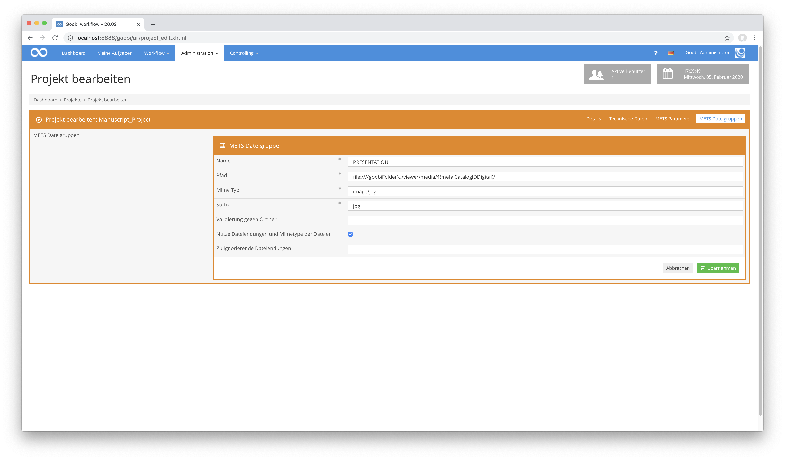
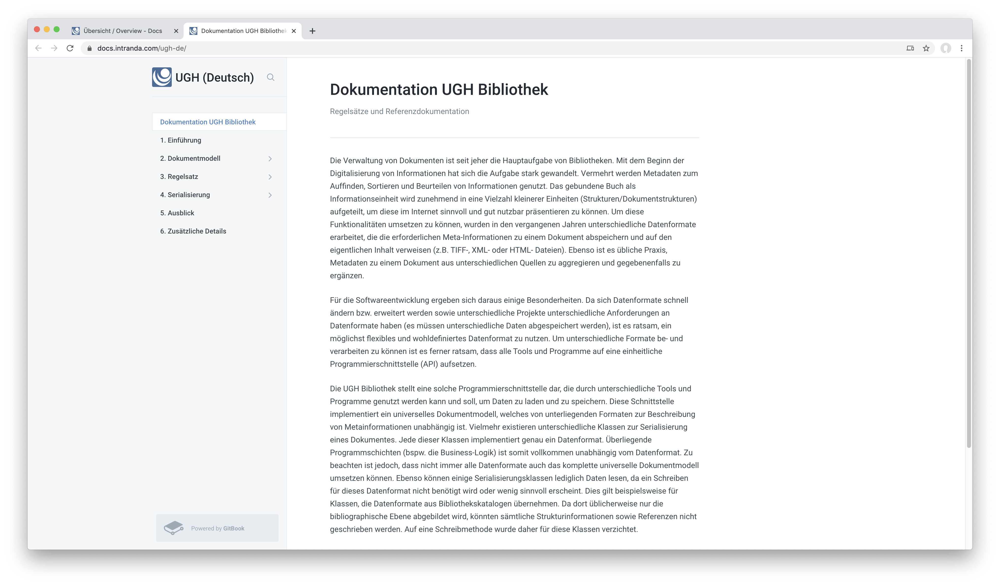

# Januar 2020

## Coming soon

* Umstellung von Goobi workflow für den Support von Java 11
* Erweiterung des Vokabularmanagers
* Implementierung eines flexiblen Editors für Handschriftenerschließung

## Erfassen von Bildausschnitten für Struktur- und Metadaten

Durch umfangreiche Anpassungen an unserer Metadaten-Bibliothek UGH und an Goobi workflow ist es nun möglich, Bildausschnitte im METS-Editor zu erfassen und ihnen Strukturelemente hinzuzufügen. Dies funktioniert durch einfaches Anklicken des entsprechenden Buttons analog zur bisherigen Auswahl eines Seitenbereiches. Anschließend kann ein Rahmen auf dem Bild aufgezogen und Struktur- sowie Metadaten zugewiesen werden. Nach dem Anlegen eines solchen Bildausschnitts verhält sich dieser ebenso wie alle bisherigen Strukturelemente.

Zu Veranschaulichung der Funktionalität und deren Bedienung steht hier ein Screencast zur Verfügung:



[https://github.com/intranda/goobi/commit/bf60d7a8c6](https://github.com/intranda/goobi/commit/bf60d7a8c6)  
[https://github.com/intranda/goobi/commit/30670c2d15](https://github.com/intranda/goobi/commit/30670c2d15)  
[https://github.com/intranda/goobi/commit/22b366738e](https://github.com/intranda/goobi/commit/22b366738e)  
[https://github.com/intranda/goobi/commit/0e85656827](https://github.com/intranda/goobi/commit/0e85656827)  
[https://github.com/intranda/goobi/commit/deb7d1c177](https://github.com/intranda/goobi/commit/deb7d1c177)  
[https://github.com/intranda/goobi/commit/0dbfd01c24](https://github.com/intranda/goobi/commit/0dbfd01c24)

## Verteilung von Rechenlast über externe Maschinen

Bereits im letzten Jahr hat eine Warteschlange \(message queue\) für die geregelte Abarbeitung lang andauernder Aufgaben in Goobi Workflow Einzug gefunden. Diese Funktionalität wurde nun nochmals etwas erweitert. Die jetzt hinzugefügte Funktionalität unterscheidet sich zu der schon vorhandenen Warteschlange darin, dass Jobs innerhalb dieser Warteschlange auch durch externe Programme außerhalb von Goobi gelesen und ausgeführt werden können. Dies ermöglicht es uns von nun an, die Last von rechenintensiven Aufgaben, wie zum Beispiel einer JPEG-Konvertierung, automatisch über mehrere Maschinen verteilen zu können. Weitere Maschinen für solche Berechnungen können jetzt ohne großen Konfigurationsaufwand hinzugefügt oder auch einfach wieder abgeschaltet werden.

[https://github.com/intranda/goobi/commit/7d61ccb265](https://github.com/intranda/goobi/commit/7d61ccb265)  
[https://github.com/intranda/goobi/commit/f2b7615cae](https://github.com/intranda/goobi/commit/f2b7615cae)  
[https://github.com/intranda/goobi/commit/e82e911e48](https://github.com/intranda/goobi/commit/e82e911e48)  
[https://github.com/intranda/goobi/commit/29c5c0275a](https://github.com/intranda/goobi/commit/29c5c0275a)  
[https://github.com/intranda/goobi/commit/99babcc433](https://github.com/intranda/goobi/commit/99babcc433)

## Rechts-nach-links-Leserichtung beim Blättern in der Bildanzeige und in den Thumbnails

Der METS-Editor unterstützt bereits seit einiger Zeit die Anzeige von rechts-nach-links geschriebenen Metadaten innerhalb von Input-Feldern. Neu ist jedoch die Möglichkeit, dass nun auch die Leserichtung eines Werkes für die Bildanzeige berücksichtigt wird. Ein Titel, dessen Leserichtung Rechts-nach-Links ist, kann als solcher markiert werden. Damit passt sich die Bildnavigation ebenso wie auch die Anzeige von Thumbnails an, so dass der Button zum Blättern zur nächsten Seite beispielsweise links statt rechts angeordnet wird. Diese Änderung wurde dabei nicht nur innerhalb des METS-Editors sondern ebenfalls im ImageQA-Plugin implementiert.

[https://github.com/intranda/goobi/commit/854d683f83b4ba0733b6a552da09726a7d0fcb97](https://github.com/intranda/goobi/commit/854d683f83b4ba0733b6a552da09726a7d0fcb97)  
[https://github.com/intranda/goobi/commit/4947bcb3a14e6549cf091821e1a017e3a29008f1](https://github.com/intranda/goobi/commit/4947bcb3a14e6549cf091821e1a017e3a29008f1)  
[https://github.com/intranda/goobi/commit/b05febe2f1a53bd3cb3880a9e8374dcf8f1744bf](https://github.com/intranda/goobi/commit/b05febe2f1a53bd3cb3880a9e8374dcf8f1744bf)  
[https://github.com/intranda/goobi/commit/e97e95ff4e1acf65ec1a7c924176b9468dbc0eaf](https://github.com/intranda/goobi/commit/e97e95ff4e1acf65ec1a7c924176b9468dbc0eaf)

## Audio/Video Medien im METS-Editor

Eine weitere größere Änderung innerhalb der Metadatenbibliothek UGH sowie im METS-Editor von Goobi workflow ist die neue Möglichkeit von nun an auch Audio- und Video-Medien darzustellen. Dabei wird technisch auf im Browser vorhandene Techniken gesetzt. Für Browser wie Firefox und Chrome bedeutet dies, dass diese beispielsweise die Wiedergabe von MP4, WebM und Ogg Videos, sowie MP3, WAV und Ogg Audio-Dateien beherrschen. Verglichen dazu unterstützt der Internet Explorer beispielsweise MP4-Videos, sowie MP3 für Audio-Medien.

[https://github.com/intranda/goobi/commit/c8c84253ba](https://github.com/intranda/goobi/commit/c8c84253ba)

## 4K Display-Unterstützung im METS-Editor

Der kürzlich runderneuerte METS-Editor verfügte über einige Darstellungsprobleme bei sehr großen Monitorauflösungen. So kam es unter anderem zu Problemen bei größeren Zoomstufen sowie bei der Nutzung von 4K-Monitoren. Diese Probleme waren letztlich auf einen Rundungsfehler zurückzuführen und konnten nun behoben werden.

[https://github.com/intranda/goobi/commit/2d79176efd](https://github.com/intranda/goobi/commit/2d79176efd)

## Aktivierung von über 200 JUnit-Tests

Nach und nach wurden über 200 JUnit-Tests wieder aktiviert. Diese automatisierten Softwaretests waren schon vor einiger Zeit entwickelt worden. Ihre Ausführung war jedoch in der Vergangenheit für die alte Continuous Integration Plattform aufgrund mangelnder Kompatibilität deaktviert worden. Durch den Umstieg auf Docker-gestützte Builds in unserem Jenkins sowie auch in Travis konnten diese Probleme nun behoben und die Tests wieder aktiviert werden.

[https://github.com/intranda/goobi/commit/0e68fc70f4](https://github.com/intranda/goobi/commit/0e68fc70f4)  
[https://github.com/intranda/goobi/commit/472bd7e0da](https://github.com/intranda/goobi/commit/472bd7e0da)

## Erste Live-Instanz von Goobi workflow innerhalb der Amazon Cloud

Seit Anfang Januar 2020 ist die erste Goobi-Instanz innerhalb der Amazon Cloud in den Produktiv-Betrieb gegangen. Viele der Entwicklungen der letzten Monate wie zum Beispiel die S3-Anbindung, die Message Queues sowie auch der Single Sign On mittels OpenID waren Teil und Vorraussetzung dieses Umzugs. Über weitere Entwicklungen in diesem Bereich werden wir hier in den nächsten Monaten weiter berichten.

## Umstellung des Loggings auf Log4j2

Die Goobi-intern eingesetzte Logging-Bibliothek Log4j war schon etwas in die Jahre gekommen. Diesen Monat haben wir es endlich geschafft, die neue Version mit neuer API in Goobi workflow zu integrieren. Diese Umstellung hat fast alle Java-Klassen in Goobi workflow betroffen und stellt damit sicherlich einen der größeren Einzelcommits in der Goobi-Geschichte dar.

[https://github.com/intranda/goobi/commit/6890576fea](https://github.com/intranda/goobi/commit/6890576fea)  
[https://github.com/intranda/goobi/commit/1927409014](https://github.com/intranda/goobi/commit/1927409014)

## Konfigurierbarer Export von Dateigruppen innerhalb von METS-Dateien

Es gibt es nun neue Möglichkeiten für die Steuerung der Erzeugung von METS Filegroups. So kann jetzt konfiguriert werden, dass statt eines festgelegten konfigurierten Mimetypes und Suffixes von nun an die Dateiendungen zurate gezogen werden, um die Mimetypes der Dateien aus dem media Ordner festzulegen. Dies erlaub eine deutlich flexiblere Generierung der METS-Dateien abhängig von den tatsächlich pro Objekt vorhandenen Dateien.

Für die Nutzung dieser Funktionalität muss innerhalb der Projekteinstellungen die entsprechende METS-Dateigruppe bearbeitet werden. Dort muss dann die Checkbox "Nutze Dateiendungen und Mimetype der Dateien" aktiviert werden.

Daneben ist es im übrigen auch möglich, einzelne Dateitypen in einer Dateigruppe auszuschließen. Dies ist zum Beispiel dann notwendig, wenn eine Filegroup für Audio-Dateien und eine weitere für das Cover-Bild erzeugt werden soll. Dazu muss entsprechend in das Feld "Zu ignorierende Dateiendungen" die Liste der unerwünschten Dateiendungen angegeben werden. Bei der Erzeugung der Filegroup für die METS-Datei werden dann alle Dateien mit dieser Dateiendung übersprungen.

[https://github.com/intranda/goobi/commit/783bb301fc](https://github.com/intranda/goobi/commit/783bb301fc)  
[https://github.com/intranda/goobi/commit/cd94e77c2c](https://github.com/intranda/goobi/commit/cd94e77c2c)

## Dokumentation von UGH ist nun online verfügbar und mehrsprachig

Für die Metadatenbibliothek UGH existierte in der Vergangenheit bereits eine umfangreiche Dokumentation als PDF-Datei. Diese wurde nun in das gleiche Dokumentationsportal überführt wie zahlreiche andere Dokumentationen zuvor ebenso.

Bei der Gelegenheit haben wir diese Dokumentation zugleich in die englische Sprache überführt. Somit läßt sich die Dokumentation von UGH von nun an deutlich besser pflegen, sowohl was die Aktualität der Inhalte betrifft als auch die Mehrsprachigkeit.

[https://docs.intranda.com/ugh-de/](https://docs.intranda.com/ugh-de/)  
[https://docs.intranda.com/ugh-en/](https://docs.intranda.com/ugh-en/)

