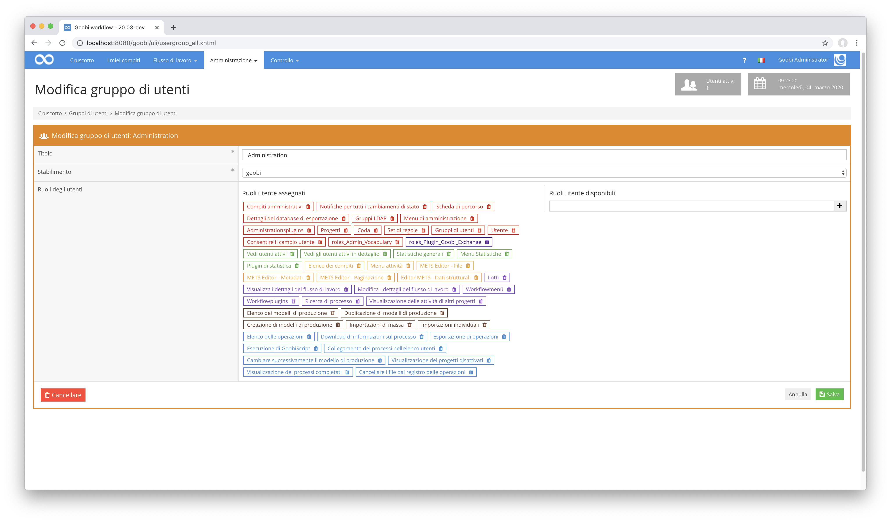
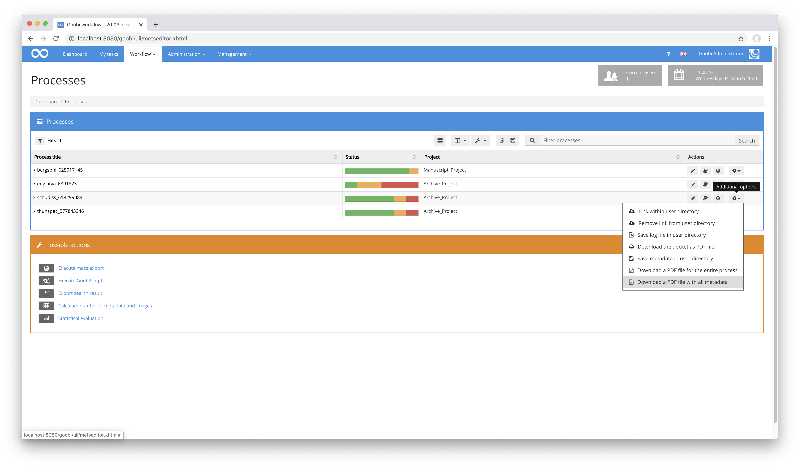
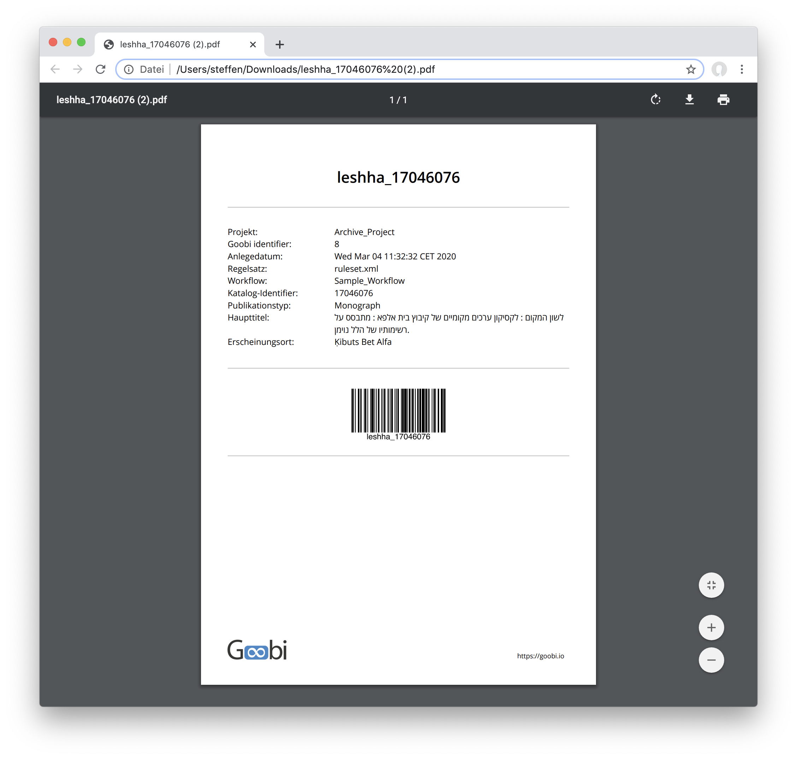
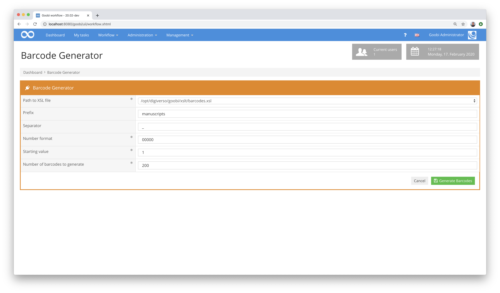

# Februar 2020

### Coming soon

In den kommenden Wochen werden wir uns voraussichtlich auf folgende Punkte konzentrieren:

* Weiterer Ausbau der Skalierbarkeit auf Cloud-Infrastruktur
* Fertigstellung des flexiblen Editors zur Handschriftenerfassung
* Automatisierung von Goobi-to-go Bereitstellung
* Ausbau der Mehrsprachigkeit

### METS-Editor: Pre-Caching von Bildern für performantere Bildanzeige

Innerhalb des METS-Editors wird jetzt das jeweils vorherige und nächste Bild von aktuell angezeigten Seite vorgeladen. Dadurch sind die Wartezeiten für das nächste anzuzeigende Bild im Falle des Umblätterns stark verkürzt worden, was sich sehr positiv auf die Bedienung des METS-Editors auswirkt.

[https://github.com/intranda/goobi/commit/cc5bf154e267a186aa12d9bbf9e8563d5b9d8e8e](https://github.com/intranda/goobi/commit/cc5bf154e267a186aa12d9bbf9e8563d5b9d8e8e)

### METS-Editor: Zoomstufe beibehalten

Eine weitere Verbesserung im METS-Editor ist eine Funktionalität, die vom Goobi viewer übernommen werden konnte. Hierbei geht es um das Beibehalten der aktuellen Zoomstufe des aktuell dargestellten Bildes beim Umblättern zu folgenden Seiten. So bleibt beispielsweise ein Zoom auf die Seitenzahl auch beim Weiterblättern durch den Bildstapel erhalten ohne das Bild wiederholt neu vergrößern und im Bildcontainer für die Anzeige ausrichten zu müssen.

[https://github.com/intranda/goobi/commit/2bcb3fff2e2f09f5178cf33431c0b1ddf3cfaa82](https://github.com/intranda/goobi/commit/2bcb3fff2e2f09f5178cf33431c0b1ddf3cfaa82)

### Ausbau der Mehrsprachigkeit - Work in progress

Goobi workflow verfügt bereits über eine Benutzeroberfläche in Deutsch, Englisch, Spanisch und Hebräisch. Derzeit arbeiten wir an einer Erweiterung des Sprachumfangs für die Sprachen Niederländisch, Portugiesisch, Französisch sowie Italienisch. Abgeschlossen sind diese Arbeiten noch nicht ganz. Wir gehen allerdings davon aus, dass wir dies in Zusammenarbeit mit den jeweiligen Muttersprachlern bereits im März abschließen werden.

[https://github.com/intranda/goobi/commit/2736b5982065579dbf95224611a2a29b081e9857](https://github.com/intranda/goobi/commit/2736b5982065579dbf95224611a2a29b081e9857) [https://github.com/intranda/goobi/commit/2736b5982065579dbf95224611a2a29b081e9857](https://github.com/intranda/goobi/commit/2736b5982065579dbf95224611a2a29b081e9857) [https://github.com/intranda/goobi/commit/b5e229ad09be7c867b3b5238724d9ae9fe04f2a6](https://github.com/intranda/goobi/commit/b5e229ad09be7c867b3b5238724d9ae9fe04f2a6) [https://github.com/intranda/goobi/commit/ef9dfc54794cb4fa662d7a299e246ea01f1a8efc](https://github.com/intranda/goobi/commit/ef9dfc54794cb4fa662d7a299e246ea01f1a8efc) [https://github.com/intranda/goobi/commit/2736b5982065579dbf95224611a2a29b081e9857](https://github.com/intranda/goobi/commit/2736b5982065579dbf95224611a2a29b081e9857) [https://github.com/intranda/goobi/commit/dbc93d187122de2b64cc6f3490a630fcd92b9d26](https://github.com/intranda/goobi/commit/dbc93d187122de2b64cc6f3490a630fcd92b9d26)

### Erweiterte Funktionalität für PDF-Generierung - auch im METS-Editor

In der Vergangenheit gab es im METS-Editor die Möglichkeit, dass der Strukturbaum ausgedruckt werden konnte. Diese Funktionalität war allerdings in den letzten Jahren nicht mehr ausreichend, da zunehmend mehr Informationen von den Anwendern benötigt wurden. Neben der Information über den Strukturbaum sollten ebenso Metadaten sowie auch der Repräsentant des Bildes mit angezeigt werden.

Diese Funktionalität wurde nun entwickelt. Sie ersetzt damit den bisherigen Button zum Ausdrucken innerhalb des METS-Editors:

Darüber hinaus ist diese Funktion auch direkt aus dem Menü der Vorgangsliste für jeden Vorgang zugänglich:

Die auf diese Weise erzeugte PDF-Datei sieht üblicherweise wie das folgende Beispiel aus. Eine individuelle Gestaltung ist aber ebenso möglich, da der Mechanismus der Generierung mittels XSLT-Transformation hinsichtlich Funktionalität und Design viele Freiheitsgrade erlaubt.

[https://github.com/intranda/goobi/commit/b81d652c29d784a08c236fe72fc4de21770bf9c6](https://github.com/intranda/goobi/commit/b81d652c29d784a08c236fe72fc4de21770bf9c6)

### Nicht-lateinische Zeichen in Laufzetteln werden unterstützt

Bisher hatten wir Probleme für die Anzeige von nicht-lateinischen Zeichen innerhalb unserer generierten Laufzettel. Durch eine Umstellung der Default-Layouts, Einbindung Unicode-fähigen Schriftarten sowie einiger Konfigurationsarbeiten ist es uns nun gelungen, dass nun zum Beispiel auch hebräische Zeichen korrekt dargestellt werden können.

[https://github.com/intranda/goobi/commit/96c6add77248342fa66ff4d242f29d847aa7bdd3](https://github.com/intranda/goobi/commit/96c6add77248342fa66ff4d242f29d847aa7bdd3)

### Java 11 Support

Mit der Weiterentwicklung von Java ging einher, dass Goobi workflow zwischenzeitlich festgelegt war darauf, dass es mit Java 8 betrieben wird. Diese Festlegung konnten wir nun beseitigen und haben eine Kompatibilität mit dem aktuellen Java 11 erreicht. Anschließend haben wir den gesamten Februar über Goobi workflow auf unseren eigenen Entwickler-Rechnern unter Java 11 ausgeführt und konnten hierbei keine weiteren Schwierigkeiten feststellen. Damit erklären wir Goobi fit für Java 11.

### Neues Plugin für TIF-Validierung und Fehlermeldung

Bisher lief die TIF-Validierung über den TaskManager. Diese Art der Ausführung hatte den Vorteil, dass Lastspitzen vermieden werden konnten. Allerdings ergab sich daraus ebenso ein Nachteil, nämlich dass eine genauere Kontrolle über den Workflow nicht möglich war. So konnte bisher nur der TIF-Validierungsschritt selbst geschlossen oder in einen Fehlerstatus versetzt werden. Mit den neuen Schritte-Plugin für Goobi Workflow is es nun möglich, automatisch nach einem Fehlschlag der automatischen Bildvalidierung einen bestimmten vorherigen Schritt zu öffnen. Dieser Schritt kann dann direkt von einem Benutzer angenommen werden, um die Fehler in den Bildern beheben zu können.

Wie sich die Schritte zwischen dem Validierungsschritt und demjenigen, an den der Fehler gemeldet wird, verhalten sollen, ist innerhalb des Plugins konfigurierbar. Ebenso wie die Frage, welche Ordnerinhalte validiert werden sollen, und wie jeweils genau die Bildvalidierung erfolgen sein soll.

Mehr Informationen sowie die Dokumentation für das Plugin finden sich hier: 



### Plugin für eine automatische Umbenennung von Dateien

Es wurde ein neues Plugin für die Umbenennung von Dateien entwickelt. Es erlaubt, dass die Bilder im Vorgangsordner automatisch nach einem frei wählbaren Schema umbenannt werden können. Hierbei stehen sämtliche Variablen zur Verfügung, die auch in Skript-Schritten und an anderen Stellen von Goobi workflow zur Verfügung stehen. Diese Variablen stehen wie gewohnt ebenfalls innerhalb der Dokumtentation von Goobi workflow zur Verfügung:



Die Dokumentation für das Plugin findet sich unter folgender Adresse: 



### Barcode-Generierungs-Plugin

Für ein Projekt wurde ein Plugin benötigt, wo individuelle Barcodes generiert werden können. Hierbei handelt es sich um ein Workflow-Plugin, innerhalb dessen lediglich ein Präfix, ein Startwert sowie eine Anzahl an zu generierenden Barcodes angegeben werden müssen. Zusätzlich besteht ausserdem die Möglichkeit, aus verschiedenen Vorlagen die Optik der Barcodes auszuwählen. Hierbei liegt ähnlich wie bei den Laufzetteln wieder eine Transformation via XSLT zu Grunde, die eine gänzlich freie visuelle Gestaltung der zu generierenden Barcodes erlaubt. Somit kann Einfluß darauf genommen werden, wie das Papierformat, das Seitenlayout, Inhalte und auch der zu verwendende Barcode-Typ gestaltet sein soll.

Die Barcodes können aussehen wie dieses Beispiel:

Eine Dokumentation für das neue Plugin findet sich unter der folgenden Adresse:



Zur Veranschaulichung der Bedienung des Plugins steht hier außerdem ein Screencast zur Verfügung:



