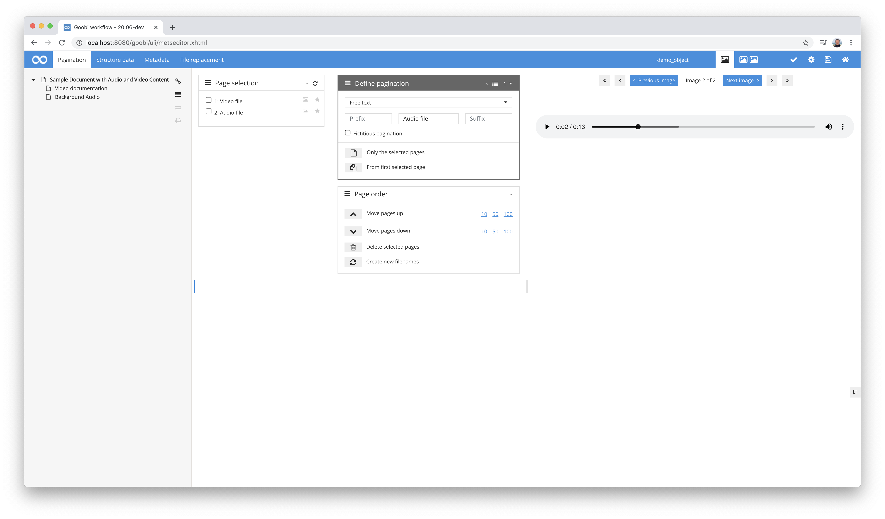
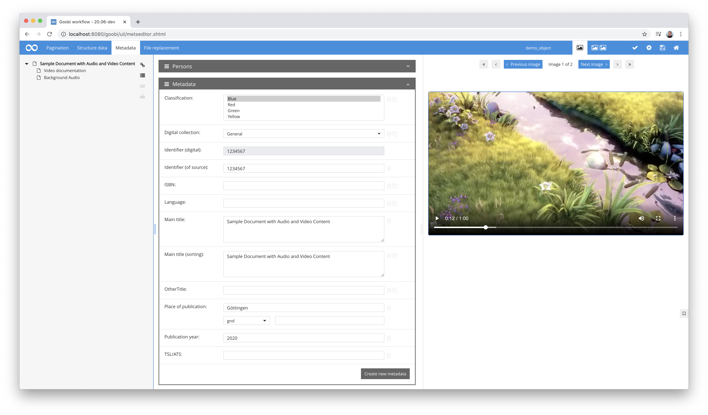

# April 2020

## Coming soon

In den kommenden Wochen werden wir uns voraussichtlich auf folgende Punkte konzentrieren:

* Refaktorisierung des LayoutWizzard-Plugins für das automatische Croppen von Bildern
* Umstellung des Goobi-Codes zur Nutzung von CDI

## Erweiterungen des LayoutWizzards zum automatischen Croppen von Bildern

Der LayoutWizzard als Plugin zum bequemen Croppen von Bildern erfreut sich immer größerer Beliebtheit. Damit einher ging nun ebenso der Wunsch, dass dessen Verwendung auch innerhalb des Amazon Cloud performant möglich sein soll. Aus diesem Grund wurde der LayoutWizzard nun dahingehend überarbeitet, dass er neben einem regulären Dateisystem ebenso wie Goobi workflow nun auch auf dem Speichersystem S3 betrieben werden kann.


Für weitere Informationen über den LayoutWizzard steht hier die ausführliche Dokumentation für die Bedienung und die Konfigurationsmöglichkeiten zur Verfügung:



## 3D-Anzeige unterstützt jetzt die DRACO Kompression

Seit einigen Monaten unterstützt Goobi workflow bereits den Umgang mit 3D-Objekten. Dies war für verschiedene Datenformate bereits gut nutzbar. Eine besondere Herausforderung war allerdings wiederholt der Umgang mit sehr großen Dateien und deren performanter Auslieferung und Anzeige. Mit der neu hinzugekommenen Funktionalität für eine Unterstützung der `DRACO` Kompression ist die Visualisierung von qualitativen 3D-Modellen jetzt deutlich besser geworden, da hierbei die Dateigrößen erheblich kleiner sind als in den bisher unterstützten Formaten.

Mehr Informationen über die Kompression mittels DRACO lassen sich hier finden:



Für den Umgang mit diesen neuen sowie bereits unterstützen 3D-Formaten ergibt sich für die Benutzer keine nennenswerte Änderung. Hier gilt auch weiterhin, dass die Objekte sowohl innerhalb des QA-Plugins als auch innerhalb des METS-Editors wie gehabt angezeigt, gezoomt sowie rotiert werden können.


[https://github.com/intranda/goobi/commit/273a53e36a0ac2614c4d95a96d41865218fe7b81](https://github.com/intranda/goobi/commit/273a53e36a0ac2614c4d95a96d41865218fe7b81)

## Verbesserung von Dateioperationen im METS-Editor

Innerhalb des METS-Editors kann ein Nutzer bereits seit längerer Zeit auch Manipulationen am Bildstapel vornehmen, um beispielsweise die Reihenfolge der Dateien zu ändern, Dateien zu löschen oder auch umzubenennen. Die Bedienung dieser Funktionalitäten war allerdings in der Vergangenheit gelegentlich problematisch, da nach Änderungen am Bildstapel stets zwingend auch die METS-Datei zusätzlich gespeichert werden musste. Mit den Überarbeitungen, die wir nun in diesem Bereich vorgenommen haben, ist dies nicht mehr nötig. Änderungen an den Dateien innerhalb des METS-Editors werden nun stets auch gleich in der METS-Datei gespeichert, so dass diese nicht mehr asynchron zu den Dateinamen werden kann. Darüber hinaus haben wir in intensiven Tests noch einmal sichergestellt, dass vorgenommene Änderungen stets auch eine Auswirkung auf alle Ordner haben. Somit werden beispielsweise Derivatdateien, Thumbnails, OCR-Ergebnisse, LayoutWizzard-Dateien und auch PDF-Dateien bei einer Umbenennung oder Löschung von Master-Dateien sofort auch mit geändert, damit sich die vorgenommene Änderung in allen Versionen des Digitalisats gleichartig auswirkt.


[https://github.com/intranda/goobi/commit/f5425981918c37ad3e77336569119777c8d68b1d](https://github.com/intranda/goobi/commit/f5425981918c37ad3e77336569119777c8d68b1d) [https://github.com/intranda/goobi/commit/8f0fc997e6c6bfa9247f76ecf337e89081177c54](https://github.com/intranda/goobi/commit/8f0fc997e6c6bfa9247f76ecf337e89081177c54)

## Bugfix für das GoobiScript addStep

Innerhalb des GoobiScripts `addStep` lag ein Fehler vor, der dessen Ausführung verhinderte. Das GoobiScript wurde nun überarbeitet und funktioniert ab sofort wieder.


[https://github.com/intranda/goobi/commit/a17dcc5d666d49c9c5cb5d9451bc6a9f8894503b](https://github.com/intranda/goobi/commit/a17dcc5d666d49c9c5cb5d9451bc6a9f8894503b)

## Darstellung von Audio und Video innerhalb des METS-Editors

In den letzten Wochen haben wir viel daran gearbeitet, dass Goobi workflow nun auch Audio- und Video-Daten direkt innerhalb des METS-Editors unterstützt und solche Dateien ebenfalls anzeigt und wiedergibt. Auf diese Weise unterstützt Goobi den Umgang mit Audio- und Video-Materialien nun noch einmal deutlich besser und erzeugt für den Export der METS-Dateien ebenfalls die korrekten Dateigruppen, um die Anzeige der veröffentlichten Digitalisate z.B. innerhalb des Goobi viewers direkt zu erlauben.





Um sicherzustellen, dass Goobi korrekt mit Audio- und Video-Daten umgeht, werden einige kleinere Anpassungen innerhalb des verwendeten Regelsatzes benötigt, um innerhalb eines Objektes neben `Seiten`, `Bildbereichen` und `3D Objekten` auch `Audio` und `Video` zu ermöglichen. Beispielhaft sieht eine solche Anpassung im Regelsatz wie folgt aus:

```markup
<DocStrctType>
  <Name>page</Name>
  <language name="de">Seite</language>
  <language name="en">Page</language>
  <language name="rusdml">page</language>
  <language name="es">Página</language>
  <allowedchildtype>area</allowedchildtype>
  <metadata num="1m">logicalPageNumber</metadata>
  <metadata num="*">_ucc_id</metadata>
  <metadata num="1m">physPageNumber</metadata>
  <metadata num="1o">_urn</metadata>
</DocStrctType>
  <DocStrctType>
  <Name>audio</Name>
  <language name="de">Audio</language>
  <language name="en">Audio</language>
  <metadata num="1o">_urn</metadata>
  <metadata num="1m">logicalPageNumber</metadata>
  <metadata num="1m">physPageNumber</metadata>
</DocStrctType>
<DocStrctType>
  <Name>video</Name>
  <language name="de">Video</language>
  <language name="en">Video</language>
  <metadata num="1o">_urn</metadata>
  <metadata num="1m">logicalPageNumber</metadata>
  <metadata num="1m">physPageNumber</metadata>
</DocStrctType>
<DocStrctType>
  <Name>object</Name>
  <language name="de">3D Objekt</language>
  <language name="en">3D Object</language>
  <metadata num="1o">_urn</metadata>
  <metadata num="1m">logicalPageNumber</metadata>
  <metadata num="1m">physPageNumber</metadata>
</DocStrctType>
<DocStrctType>
  <Name>area</Name>
  <language name="de">Bildbereich</language>
  <language name="en">Area</language>
  <metadata num="*">_ucc_id</metadata>
  <metadata num="1o">_urn</metadata>
  <metadata num="1o">_COORDS</metadata>
  <metadata num="1o">_SHAPE</metadata>
  <metadata num="1m">physPageNumber</metadata>
  <metadata num="1m">logicalPageNumber</metadata>
</DocStrctType>  
<DocStrctType>
  <Name>BoundBook</Name>
  <language name="de">Gebundenes Buch</language>
  <language name="en">Bound Book</language>
  <allowedchildtype>page</allowedchildtype>
  <allowedchildtype>audio</allowedchildtype>
  <allowedchildtype>video</allowedchildtype>
  <allowedchildtype>object</allowedchildtype>
  <metadata num="1o">PhysicalLocation</metadata>
  <metadata num="1o">datedigit</metadata>
  <metadata num="1o">shelfmarksource</metadata>
  <metadata num="1o">mediumsource</metadata>
  <metadata num="1o">FormatSourcePrint</metadata>
  <metadata num="*">_ucc_id</metadata>
  <metadata num="1o">shelfmarkarchiveimageset</metadata>
  <metadata num="1o">pathimagefiles</metadata>
  <metadata num="1o">imagedescr</metadata>
  <metadata num="1o">copyrightimageset</metadata>
  <metadata num="1o">_urn</metadata>
  <metadata num="1o">_representative</metadata>
</DocStrctType>
```

Abhängig davon, mit welchen Audio- und Videoformaten Sie an dieser Stelle arbeiten, können diese innerhalb des Webbrowsers ohne weitere Plugins wiedergegeben werden. Da dies von Browser zu Browser allerdings noch einmal unterschiedlich ist, hat sich bewährt die Derivate auf mp3 für Audiodateien und mp4 für Videodateien zu verwenden. Im Folgenden einmal eine Aufstellung welche Browser welche Dateiformate unmittelbar unterstützen:

Videoformate:

| Browser | MP4 | WebM | Ogg |
| :--- | :--- | :--- | :--- |
| Edge/Internet Explorer | YES | NO | NO |
| Chrome | YES | YES | YES |
| Firefox | YES | YES | YES |
| Safari | YES | NO | NO |
| Opera | YES | YES | YES |

Audioformate:

| Browser | MP3 | WAV | OGG |
| :--- | :--- | :--- | :--- |
| Edge/Internet Explorer | YES | NO | NO |
| Chrome | YES | YES | YES |
| Firefox | YES | YES | YES |
| Safari | YES | YES | NO |
| Opera | YES | YES | YES |

[https://github.com/intranda/goobi/commit/368c3c102df57806ba6cf7f652730cc4ce495577](https://github.com/intranda/goobi/commit/368c3c102df57806ba6cf7f652730cc4ce495577) [https://github.com/intranda/goobi/commit/f9953fe0e91a2e3494bf23e1338b7daca63b6aa2](https://github.com/intranda/goobi/commit/f9953fe0e91a2e3494bf23e1338b7daca63b6aa2) [https://github.com/intranda/goobi/commit/da4cb26bd48ba93b837ba062e0592f99535d6142](https://github.com/intranda/goobi/commit/da4cb26bd48ba93b837ba062e0592f99535d6142)

## Überarbeitung und Dokumentation des Plugins für Anpassungen an Anchor-Datensätzen

Das bereits existierende Plugin für die einheitliche Anpassung von Anchor-Datensätzen wurde einmal gründlich überarbeitet und dokumentiert. Es erlaubt eine Auswahl eines zentralen Goobi-Vorgangs z.B. für ein mehrbändiges Werk oder eine Zeitschrift, der für sämtliche anderen Goobi-Vorgänge den Master-Vorgang bilden soll. Änderungen innerhalb dessen Anchor-Datei im Mets-Editor haben somit zur Folge, dass alle zugehörigen Goobi-Vorgänge mit den identischen Daten des zentralen Anchor-Datensatzes aktualisiert werden können.


Neben einigen kleinen optischen Anpassungen wurde für dieses Plugin nun eine ausführliche Dokumentation erstellt. Diese steht hier zur Verfügung:



## Datenverarbeitung des digitalen Stadtarchiv Duderstadt

Das Stadtarchiv Duderstadt war bereits sehr früh sehr fortschrittlich und digitalisierte in den 90er Jahren das gesamte Archiv und erzeugte einen enormen [Datenbestand samt Metadaten und Transkriptionen](http://stadtarchiv-duderstadt.gbv.de/projekt-d.htm). Wir haben uns mit diesen Daten bereits seit längerem beschäftigt und nun sämtliche Daten importiert. Die bisher proprietär vorliegenden Daten wurden in ein EAD-Format überführt und die einzelnen Objekte jeweils zusätzlich in jeweils einer METS-Datei beschrieben, so dass sämtliche tief erschlossenen Metadaten nun neu veröffentlicht werden können.


Der gesamte Datenbestand des Stadtarchivs Duderstadt wurde auch bereits für die Veröffentlichung innerhalb eines Goobi viewers aufbereitet und ist als Prototyp bereits nutzbar. Vor der Bekanntgabe der URL müssen hier jedoch noch einige vorrangig visuelle Arbeiten abgeschlossen werden. Dies wird allerdings schon relativ bald erfolgen und anschließend auch hier noch einmal neu dokumentiert.

## Neue Dokumentation der Konfiguration für die REST-Schnittstelle

Goobi workflow verfügt bereits seit längerem über eine erweiterbare REST-Schnittstelle, um externe Systeme mit Goobi kommunizieren zu lassen. Die hierfür existierende Dokumentation innerhalb des Handbuchs wurde überarbeitet. Damit steht unter der folgenden Adresse eine aktuelle Fassung der Dokumentation bereit, wie die Schnittstelle für ausgewählte Endpoints gezielt für ausgewählte IP-Adressen freigeschaltet werden kann:



