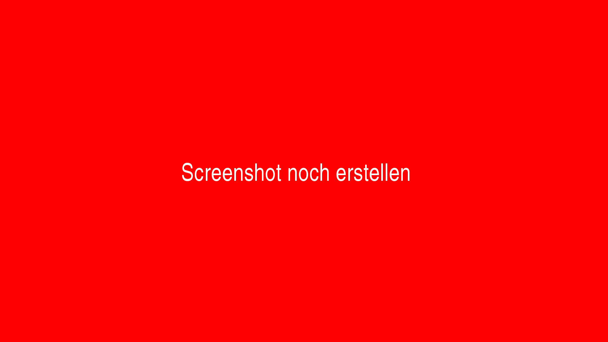

# Januar 2021

## Coming soon

- abc

## Neue Funktion für die Dokumentation von Schäden vor dem Beginn der Digitalisierung

Goobi workflow verfügt nun über eine neue Funktionalität für die Dokumentation von Schäden, die bereits beim Anlegen von Vorgängen bekannt sind und mittels Fotos festgehalten werden sollen. Dies ist insbesondere dann hilfreich, wenn die betroffenen Werke beispielsweise an einen Dienstleister ausgehändigt werden sollen und somit der Zustand der Werke vor der Übergabe dokumentiert werden soll. Die hierbei hochgeladenen Fotos und Beschreibungen werden dabei innerhalb des Vorgangslogs gespeichert und können jederzeit wieder eingesehen werden.

Ein positiver Nebeneffekt, der durch die Einfürhung dieser neuen Funktionalität aufgetreten ist, ist die somit ebenfalls hinzugewonnene neue Funktionalität, dass somit auch direkt beim Anlegen von Vorgängen Masterbilder und andere Dateien bereits in Goobi eingespielt werden können, ohne dass dies in einem eigenen Arbeitsschritt passieren muss. Dies dürfte insbesondere für kleine Projektteams interessant sein.

Um diese neue Funktionalität zu aktivieren, muss innerhalb der Konfigurationsdatei `/opt/digiverso/goobi/config/goobi_projects.xml` folgende Block innerhalb es Elements `<createNewProcess>` für einzelne Projekte definiert wird:

```xml
<fileupload use="true">
    <folder>intern</folder>
</fileupload>         
```

Sobald diese Funktion aktiviert ist, passt sich die Nutzeroberfläche von Goobi darauf hin an, indem beim Anlegen von Vorgängen nicht mehr der Button zum Speichern angezeigt wird, sondern stattdessen ein Button sichtbar wird, der zur nächsten Seite führt.


Soll nicht nur ein Upload von Schadensdokumentationen erfolgen sonden auch bereits vor dem Anlegen von Vorgängen ein Upload von Dateien in ausgewählte Ordner ermöglicht werden, kann die Konfiguration beispielhaft wie folgt vorgenommen werden:

```xml
<fileupload use="true">
    <folder>intern</folder>
    <folder>export</folder>
    <folder>master</folder>
    <folder>media</folder>
</fileupload>         
```

Hat der Nutzer auf den Button zum Gelangen auf die nächste Seite geklickt, so kann hier ein globaler Kommentar eingegeben werden, der für alle Bilder gelten soll. Anschließend kann der Bilder der Fotos erfolgen.


Nach dem Hochladen in den gewählten Ordner werden die Bilder samt zugehörigem Kommentar angezeigt und beim Vorgang gespeichert. Die Kommentare zu den einzelnen Bildern können natürlich pro Bild individuell sein. 


Zu beachten ist, dass die Kommentare ausschließlich für diejenigen Bilder gespeichert werden, die in den Ornder `ìntern` als Schadensdokumentation geladen werden. Bilder, die hingegen z.B. als Masterbilder hochgeladen werden verfügen nicht über die Möglichkeit pro Datei einen Kommentar mitzuführen.

## Anzeige der Schadensdokumentation innerhalb des Laufzettels

Die neue Funktion für die Schadensdokumentation kann innerhalb der automatisch generierten Laufzettel berücksichtigt werden. Dabei werden alle hochgeladenen Bilder samt der zugehörigen Kommentare auf den Folgeseiten des Laufzeittels aufgeführt.


Zur Aktivierung dieser Anzeige im Laufzettel sollte in die Konfigurationsdateien `/opt/digiverso/goobi/xslt/docket.xsl` und `/opt/digiverso/goobi/xslt/docket_english.xsl` ein Block wie der folgende eingefügt werden:

```xml
<xsl:if test="goobi:log/goobi:file">
  <fo:page-sequence master-reference="A5">
    <fo:flow flow-name="xsl-region-body" font-family="opensans, unicode">

      <!-- title of process -->
      <fo:block text-align="center" font-weight="bold" font-size="11pt" margin-top="0pt">
          <xsl:text disable-output-escaping="yes">Schadensdokumentation für: </xsl:text>
          <xsl:value-of select="goobi:title"/>
      </fo:block>
      <!-- // title of process -->
      <fo:block border-top-width="1pt" border-top-style="solid" border-top-color="#cccccc" margin-top="10pt"/>

      <!-- show all images uploaded into the process log -->
      <xsl:for-each select="goobi:log/goobi:file">
        <xsl:if test="not(position() > 20)">
          <fo:block text-align="center" font-size="12pt" margin-top="10pt">
            <fo:external-graphic src="url('{@url}')" content-height="80mm"/>
          </fo:block>
          <fo:block text-align="center" font-size="9pt" margin-top="5pt">
            <xsl:value-of select="@comment" />
          </fo:block>
        </xsl:if>
      </xsl:for-each>
      <!-- // show all images uploaded into the process log -->

    </fo:flow>
  </fo:page-sequence>
</xsl:if>
```


## Komprimierter Repräsentant bei der Generierung der Metadaten-PDF-Datei

Die PDF-Datei die Goobi auf Basis der Metadaten erzeugen kann, enthält üblicherweise ein Bild des Repräsentanten. Dieses Bild war bisher in unkomprimierter Fassung enthalten, so dass die PDF-Dateien zum Teil sehr groß waren. Dies wurde nun so geändert, dass die eingebetteten Bilder nun zunächst duch eine JPEG-Kompression laufen und erst im Anschluß in die PDF-Datei eingebettet werden. In dem Kontext wurde auch eine Anpassung für die Konfiguration der Gestaltung dieser PDF-Dateien vorgenommen. Entsprechend müssen diese Änderungen bei Updates nun ebenfalls in den Goobi-Installationen berücksichtigt werden. Bisher wurde üblicherweise dieser Block in der Konfigurationsdatei `/opt/digiverso/goobi/xslt/docket_metadata.xsl` verwendet:

```xml
<!-- thumbnail on right side -->
<fo:block-container position="fixed" left="11.5cm" top="1cm">
  <fo:block>
      <fo:external-graphic src="url('{goobi:thumbnail}')" content-height="100mm"/>
  </fo:block>
</fo:block-container>
<!-- // thumbnail on right side -->
```

Dieser Block muss bezüglich des Bildpfades von nun an wie folgt angepasst werden:

```xml
<!-- thumbnail on right side -->
<fo:block-container position="fixed" left="11.5cm" top="1cm">
  <fo:block>
      <fo:external-graphic src="url('{goobi:representative/@url}')" content-height="100mm"/>
  </fo:block>
</fo:block-container>
<!-- // thumbnail on right side -->
```

Das Encoding der Datei sollte darüber hinaus angepasst werden, so dass es auf `utf-8` umgestellt ist:

```xml
<?xml version="1.0" encoding="utf-8"?>
```

## Anpassung für den Standard-Laufzettel

Der Standard-Laufzettel von Goobi workflow benötigt ebenfalls eine Änderung innerhalb der Konfiguration für die korrekte Anzeige des intern umbenannten Anlegedatums für den Vorgang. Bisher wurde üblicherweise dieser Ausdruck in den Konfigurationsdateien `/opt/digiverso/goobi/xslt/docket.xsl` und `/opt/digiverso/goobi/xslt/docket_english.xsl` verwendet:

```xml
<xsl:value-of select="goobi:time"/>
```

Dieser Ausdruck muss wie folgt angepasst werden:

```xml
<xsl:value-of select="goobi:creationDate"/>
```

Und auch das Encoding dieser Dateien sollte angepasst werden, so dass es auf `utf-8` umgestellt ist:

```xml
<?xml version="1.0" encoding="utf-8"?>
```

## Anpassung für den Batch-Laufzettel

Auch der Batch-Laufzettel benötigt eine Änderung in der Konfiguration für die korrekte Anzeige des Anlegedatums für der Vorgänge.

In der Datei `/opt/digiverso/goobi/xslt/docket_multipage.xsl` stand bisher dieser Wert:

```xml
<xsl:value-of select="goobi:process/goobi:time" />
```

Dieser Ausdruck muss wie folgt angepasst werden:

```xml
<xsl:value-of select="goobi:process/goobi:creationDate" />
```

Auch hier sollte das Encoding der Datei angepasst werden, um es auf `utf-8` umzustellen:

```xml
<?xml version="1.0" encoding="utf-8"?>
```

## Catalogue Poller und Catalogue Request mit erweiterten Funktionen

Die beiden Plugins wurden erweitert. Zeitsteuerung für den Catalogue Poller wurde implementiert. Und es wurde implementiert, dass auch für Unterelemente Abfragen an den Katalog gestellt werden können. Für die Aktualisierung des Plugins wird benötigt, dass die Konfiguration angepasst wird. Details zur Konfiguration finden sich innerhalb der Plugindokumentation.




## Neue GoobiScript Syntax (YAML)


## Neues GoobiScript "addStepAtOtherStepPosition"

Beispielaufruf:

```yaml
---
# This GoobiScript allows to add a new workflow step into the workflow before or after an other step (defined by name).
action: addStepAtOtherStepPosition

# The new step can be executed "before" or "after" the existing step.
insertionstrategy: after

# Title of the existing workflow step
existingsteptitle: Scanning

# Title of the new workflow step
newsteptitle: Analyzing
```


## Nutzung von CDI

Der technische Unterbau von Goobi workflow wurde auf CDI umgestellt. Diese Änderung war nötig, um Goobi workflow auch in Zukunft mit wichtigen Sicherheitsupdates versorgen zu können. Außerdem eröffnet uns dieser Umstieg einige neue technische Möglichkeiten, wie zum Beispiel die Nutzung von Websockets. Mit Websockets kann der Server den Client (also den Browser, zum Beispiel Firefox) proaktiv über Änderungen informieren. Diese neue Technologie ist zum Beispiel für länger laufende Aufgaben wie Importe oder auch die Goobiscripte praktisch, um den Nutzer über den Fortschritt informiert zu halten. 

## Feature x

Beschreibung y


## Feature x

Beschreibung y


https://github.com/intranda/goobi-workflow/commit/00000000000000000000000000000

## Feature x

Beschreibung y


https://github.com/intranda/goobi-workflow/commit/00000000000000000000000000000
