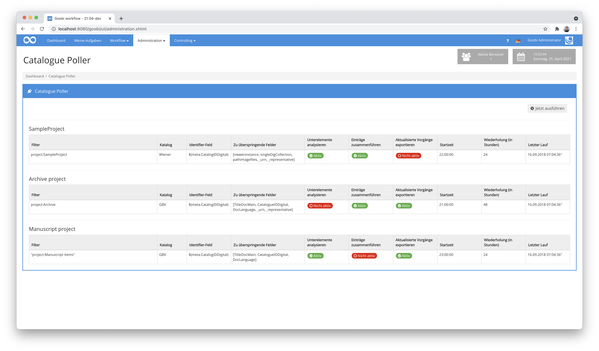

# Januar 2021

## Coming soon

- Flex-Editor für die Erfassung von Handschriften und anderes
- Erweiterung des Rechtemanagements für individuelle GoobiScripte
- Erweiterung des Dashboards
- Bessere Unterstützung von Körperschaften

## Neue Funktion für die Dokumentation von Schäden vor dem Beginn der Digitalisierung

Goobi workflow verfügt nun über eine neue Funktionalität für die Dokumentation von Schäden, die bereits beim Anlegen von Vorgängen bekannt sind und mittels Fotos festgehalten werden sollen. Dies ist insbesondere dann hilfreich, wenn die betroffenen Werke beispielsweise an einen Dienstleister ausgehändigt werden sollen und somit der Zustand der Werke vor der Übergabe dokumentiert werden soll. Die in diesem Kontext hochgeladenen Fotos und Beschreibungen werden  innerhalb des Vorgangslogs gespeichert und können jederzeit wieder eingesehen werden.

Ein positiver Nebeneffekt, der durch die Einführung dieser neuen Funktionalität aufgetreten ist, ist die somit ebenfalls hinzugewonnene neue Funktionalität, dass ab jetzt auch direkt beim Anlegen von Vorgängen Masterbilder und andere Dateien bereits in Goobi eingespielt werden können, ohne dass dies in einem eigenen Arbeitsschritt passieren muss. Dies dürfte sich insbesondere für kleine Projektteams als praktische Neuerung erweisen.

Um diese neue Funktionalität zu aktivieren, muss innerhalb der Konfigurationsdatei `/opt/digiverso/goobi/config/goobi_projects.xml` folgender Block innerhalb es Elements `<createNewProcess>` für einzelne Projekte definiert sein:

```xml
<fileupload use="true">
    <folder>intern</folder>
</fileupload>         
```

Sobald diese Funktion aktiviert ist, passt sich die Nutzeroberfläche von Goobi workflow daraufhin an, indem beim Anlegen von Vorgängen nicht mehr der Button zum Speichern angezeigt wird, sondern stattdessen ein Button sichtbar wird, der zur nächsten Seite führt.


Soll nicht nur ein Upload von Schadensdokumentationen erfolgen sonden auch bereits vor dem Anlegen von Vorgängen ein Upload von Dateien in ausgewählte Ordner ermöglicht werden, kann die Konfiguration beispielhaft wie folgt vorgenommen werden:

```xml
<fileupload use="true">
    <folder>intern</folder>
    <folder>export</folder>
    <folder>master</folder>
    <folder>media</folder>
</fileupload>         
```

Hat der Nutzer auf den Button zum Gelangen auf die nächste Seite geklickt, so kann hier ein globaler Kommentar eingegeben werden, der für alle Bilder gelten soll. Anschließend kann der Upload der Dateien erfolgen.


Nach dem Hochladen in den gewählten Ordner werden die Bilder samt zugehörigem Kommentar angezeigt und beim Vorgang gespeichert. Die Kommentare zu den einzelnen Bildern können natürlich pro Bild individuell sein. 


Zu beachten ist, dass die Kommentare ausschließlich für diejenigen Bilder gespeichert werden, die in den Ordner `ìntern` als Schadensdokumentation geladen werden. Bilder, die hingegen z.B. als Masterbilder hochgeladen werden, verfügen nicht über die Möglichkeit pro Datei einen Kommentar mitzuführen.

## Anzeige der Schadensdokumentation innerhalb des Laufzettels

Die neue Funktion für die Schadensdokumentation kann innerhalb der automatisch generierten Laufzettel berücksichtigt werden. Dabei werden alle hochgeladenen Bilder samt der zugehörigen Kommentare auf den Folgeseiten des Laufzeittels aufgeführt.


Zur Aktivierung dieser Anzeige im Laufzettel sollte in die Konfigurationsdateien `/opt/digiverso/goobi/xslt/docket.xsl` und `/opt/digiverso/goobi/xslt/docket_english.xsl` ein Block wie der folgende eingefügt werden:

```xml
<xsl:if test="goobi:log/goobi:file">
  <fo:page-sequence master-reference="A5">
    <fo:flow flow-name="xsl-region-body" font-family="opensans, unicode">

      <!-- title of process -->
      <fo:block text-align="center" font-weight="bold" font-size="11pt" margin-top="0pt">
          <xsl:text disable-output-escaping="yes">Schadensdokumentation für: </xsl:text>
          <xsl:value-of select="goobi:title"/>
      </fo:block>
      <!-- // title of process -->
      <fo:block border-top-width="1pt" border-top-style="solid" border-top-color="#cccccc" margin-top="10pt"/>

      <!-- show all images uploaded into the process log -->
      <xsl:for-each select="goobi:log/goobi:file">
        <xsl:if test="not(position() > 20)">
          <fo:block text-align="center" font-size="12pt" margin-top="10pt">
            <fo:external-graphic src="url('{@url}')" content-height="80mm"/>
          </fo:block>
          <fo:block text-align="center" font-size="9pt" margin-top="5pt">
            <xsl:value-of select="@comment" />
          </fo:block>
        </xsl:if>
      </xsl:for-each>
      <!-- // show all images uploaded into the process log -->

    </fo:flow>
  </fo:page-sequence>
</xsl:if>
```


## Komprimierter Repräsentant bei der Generierung der Metadaten-PDF-Datei

Die PDF-Datei die Goobi auf Basis der Metadaten erzeugen kann, enthält üblicherweise ein Bild des Repräsentanten. Dieses Bild war bisher in unkomprimierter Fassung enthalten, so dass die PDF-Dateien zum Teil sehr groß waren. Dies wurde nun so geändert, dass die eingebetteten Bilder nun zunächst duch eine JPEG-Kompression laufen und erst im Anschluß in die PDF-Datei eingebettet werden. In dem Kontext wurde auch eine Anpassung für die Konfiguration der Gestaltung dieser PDF-Dateien vorgenommen. Entsprechend müssen diese Änderungen bei Updates nun ebenfalls in den Goobi-Installationen berücksichtigt werden. Bisher wurde üblicherweise dieser Block in der Konfigurationsdatei `/opt/digiverso/goobi/xslt/docket_metadata.xsl` verwendet:

```xml
<!-- thumbnail on right side -->
<fo:block-container position="fixed" left="11.5cm" top="1cm">
  <fo:block>
      <fo:external-graphic src="url('{goobi:thumbnail}')" content-height="100mm"/>
  </fo:block>
</fo:block-container>
<!-- // thumbnail on right side -->
```

Dieser Block muss bezüglich des Bildpfades von nun an wie folgt angepasst werden:

```xml
<!-- thumbnail on right side -->
<fo:block-container position="fixed" left="11.5cm" top="1cm">
  <fo:block>
      <fo:external-graphic src="url('{goobi:representative/@url}')" content-height="100mm"/>
  </fo:block>
</fo:block-container>
<!-- // thumbnail on right side -->
```

Das Encoding der Datei sollte darüber hinaus angepasst werden, so dass es auf `utf-8` umgestellt ist:

```xml
<?xml version="1.0" encoding="utf-8"?>
```

## Anpassung für den Standard-Laufzettel

Der Standard-Laufzettel von Goobi workflow benötigt ebenfalls eine Änderung innerhalb der Konfiguration für die korrekte Anzeige des intern umbenannten Anlegedatums für den Vorgang. Bisher wurde üblicherweise dieser Ausdruck in den Konfigurationsdateien `/opt/digiverso/goobi/xslt/docket.xsl` und `/opt/digiverso/goobi/xslt/docket_english.xsl` verwendet:

```xml
<xsl:value-of select="goobi:time"/>
```

Dieser Ausdruck muss wie folgt angepasst werden:

```xml
<xsl:value-of select="goobi:creationDate"/>
```

Und auch das Encoding dieser Dateien sollte angepasst werden, so dass es auf `utf-8` umgestellt ist:

```xml
<?xml version="1.0" encoding="utf-8"?>
```

## Anpassung für den Batch-Laufzettel

Auch der Batch-Laufzettel benötigt eine Änderung in der Konfiguration für die korrekte Anzeige des Anlegedatums für der Vorgänge.

In der Datei `/opt/digiverso/goobi/xslt/docket_multipage.xsl` stand bisher dieser Wert:

```xml
<xsl:value-of select="goobi:process/goobi:time" />
```

Dieser Ausdruck muss wie folgt angepasst werden:

```xml
<xsl:value-of select="goobi:process/goobi:creationDate" />
```

Auch hier sollte das Encoding der Datei angepasst werden, um es auf `utf-8` umzustellen:

```xml
<?xml version="1.0" encoding="utf-8"?>
```

## Catalogue Poller und Catalogue Request mit erweiterten Funktionen

Seit einiger Zeit schon verfügt Goobi über zwei verschiedene Plugins, um auch im laufenden Workflow bzw. sogar periodisch Katalogabfragen durchführen zu können, damit Metadaten importiert bzw. aktualisiert werden. Diese beiden Plugins wurden einmal gründlich erweitert und in ihrer Dokumentation angepasst. Für den Catalogue Poller wurde eine neue Zeitsteuerung implementiert, die erlaubt, dass gezielt definierte Datenbestände in konfigurierbaren Zeitabständen aktualisiert werden. Darüber hinaus sind sowohl der `Catalogue Poller` als auch das `Catalogue Request Plugin`dahingehend erweitert worden, dass jetzt auch für Unterelemente Abfragen an den Katalog gestellt werden können, um diese zu aktualisieren. 



Wie genau die Konfiguration aufgebaut sein muss, um diese neuen Funktionen verwenden zu können, ist in den jeweiligen Dokumentationen der beiden Plugins erläutert.

Hier findet sich die neue ausführliche Dokumentation des Catalogue Request Plugins:



Und hier findet sich die aktualisierte Dokumentation des Catalogue Pollers:



## Neue GoobiScript Syntax (YAML)

Mit GoobiScript verfügt Goobi workflow schon seit geraumer Zeit über einen Mechanismus, um auch umfangreiche Listen an Vorgängen in Masse ändern zu können. Dies kann die Durchführung von Exporten sein, Änderungen am Workflowstatus betreffen, das Hinzufügen von Metadaten innerhalb der METS-Dateien umfassen und vieles mehr. Über die Jahre sind zahlreiche GoobiScripte mit jeweils neuen Funktionen hinzugekommen, die wir auch jeweils auf einer eigenen Dokumentationsseite detailliert erläutern. Dennoch fanden wir den Aufbau der Kommandos langfristig nicht für den richtigen Weg, so dass wir uns dazu entschieden haben, hier eine größere Umstellung vorzunehmen. Statt der bisherigen Syntax verwendet GoobiScript nun die Sprache YAML zur definition von GoobiScripten. Der Aufbau der Kommandos ist damit ein bisschen anders als in der Vergangenheit. Allerdings bringt die Umstellung mehrere große Vorteile mit sich.


Einerseits verfügt die Darstellung der Kommandos von nun an über ein Syntax-Highlighting, so dass das Lesen und Schreiben der GoobiScripte durch die Formatierung und Farben deutlich übersichtlicher geworden ist. Und zum anderen bringen alle GoobiScripte von nun auch eine eigene eingebettete Dokumentation samt Beispielen mit, die über jedem Parameter jeweils aufgeführt wird. Damit ist die Rechnerche, wie ein spezielles Kommando zu verwenden ist noch einmal deutlich einfacher geworden.

```yaml
---
# This GoobiScript allows to assign a user group to an existing workflow step.
action: addUserGroup

# Title of the workflow step to be edited
steptitle: Upload images

# Use the name of the user group to be assigned to the selected workflow step.
group: Photographers
```

Ein weiterer enormer Zugewinn der Umstellung auf das neue Format YAML ist, dass wir nun auch sehr übersichtlich verschiedene GoobiScripte übersichtlich hintereinander im gleichen Aufruf kombinieren können, indem diese jeweils mit der Trennlinie als Separator nacheinander aufgeführt werden. 

```yaml
---
# This GoobiScript allows to add a new workflow step into the workflow.
action: addStep

# Title of the workflow step to add
steptitle: Upload images

# This number defines where in the workflow this new step is ordered into.
number: 3

---
# This GoobiScript allows to assign a user group to an existing workflow step.
action: addUserGroup

# Title of the workflow step to be edited
steptitle: Upload images

# Use the name of the user group to be assigned to the selected workflow step.
group: Photographers

---

[...]

```

Hierbei kann die mitgelieferte Dokumentation für eine bessere Übersicht auch einfach entfernt werden:


Die Dokumentation für die Verwendung von GoobiScript findet sich hier, wo die Bedienung und Möglichkeiten genau erläutert werden:



## Neues GoobiScript "addStepAtOtherStepPosition"

Es wurde ein neues GoobiScript entwickelt, dass es nun ermöglicht, dass neue Arbeitsschritte besser in den Workflow integriert werden können. Mit diesem Kommando ist es nun möglich, die neue Zielposition innerhalb des Workflows anzugeben, die noch durch einen anderen Arbeitsschritt belegt wird. Durch den Aufruf dieses Kommandos ist es nun möglich, dass der neue Arbeitsschritt an dieser gewünschten Postion eingefügt wird und alle nachfolgenden Arbeitsschritte entsprechend an die richtigen Postionen verschoben werden.

```yaml
---
# This GoobiScript allows to add a new workflow step into the workflow before or after another step (defined by name).
action: addStepAtOtherStepPosition

# The new step can be executed "before" or "after" the existing step.
insertionstrategy: after

# Title of the existing workflow step
existingsteptitle: Scanning

# Title of the new workflow step
newsteptitle: Analyzing
```


Die Dokumentation für das neue GoobiScript findet sich hier:



## Nutzung von CDI

Der technische Unterbau von Goobi workflow wurde auf CDI umgestellt. Diese Änderung war nötig, um Goobi workflow auch in Zukunft mit wichtigen Sicherheitsupdates versorgen zu können. Außerdem eröffnet uns dieser Umstieg einige neue technische Möglichkeiten, wie zum Beispiel die Nutzung von Websockets. Mit Websockets kann der Server den Client (also den Webbrowser) proaktiv über Änderungen informieren. Diese neue Technologie ist zum Beispiel für länger laufende Aufgaben wie Importe oder auch die GoobiScripte außerst praktisch, um den Nutzer über den Fortschritt informiert zu halten. 