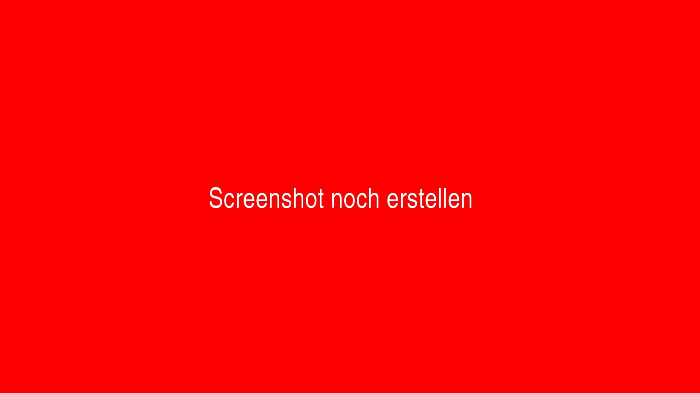

# Februar 2021

## Coming soon

- 

## Anpassung für das Change-Workflow-Plugin

Im Change-Workflow-Plugin wurden einige Erweiterungen für die Funktionalität vorgenommen. So lässt sich von nun an nicht nur der Status von Aufgaben ändern sondern auch die Zuweisung von Benutzergruppen. Eine Konfiguration hierfür sieht beispielsweise wie folgt aus:

```xml
<config>
    <!-- which projects to use for (can be more then one, otherwise use *) -->
    <project>*</project>
    <step>*</step>

    <!-- multiple changes can be done within one configuration rule; simply add another 'change' element with other properties here -->
    <change>
      <!-- name of the property to check -->
      <propertyName>{meta.ISBN}</propertyName>
      <!-- expected value (can be blank too) -->
      <propertyValue></propertyValue>
      <!-- condition for value comparing, can be 'is' or 'not' or 'missing' or 'available' -->
      <propertyCondition>missing</propertyCondition>

      <!-- list of steps to deactivate -->
      <steps type="deactivate">
          <title>Metadata enrichment</title>
      </steps>

      <!-- user groups to assign -->
      <usergroups step="Metadata enrichment">
          <usergroup>Administration</usergroup>
      </usergroups>
    </change>
</config>
```

Hinzu kommt, dass mit diesem Update nicht mehr allein Eigenschaften der Vorgänge auf ihre Werte hin geprüft werden können. Stattdessen können nun alle zur Verfügung stehenden Werte, die als Variablen ausgedrückt werden können, verwendet werden. Aus den bisherigen Konfigurationen in dieser Form:

```xml
<propertyName>Template</propertyName>
```

müssen in den Konfigurationsdateien nun solche Formulierungen verwendet werden:

```xml
<propertyName>{process.Template}</propertyName>
```

Weitere Erläuterungen über die Möglichkeiten der Variablen finden sich unter folgender URL:



Die aktualisierte Dokumentation für das Change-Workflow-Plugin findet sich hier:



## Neue Suchmöglichkeiten für eine Suche nach Vorgängen anhand eines Datums

Wir haben die Suchmöglichkeiten erweitert, so dass es nun möglich ist, dass Vorgänge anhand ihres Erstellungsdatums gefunden werden können. Die Suchsyntax sieht dabei folgendermaßen aus.

```
processdate=2021
```

Es ist auch möglich, nach Prozessen, die vor oder nach einem bestimmten Datum (oder auch einer Uhrzeit) erstellt wurden, zu filtern:

```
"processdate<2020-01-01 12:00:00"
```

Diese neuen Suchparameter ermöglichen somit ebenfalls eine Suche von Vorgängen nach einem Zeitraum:

```
processdate>2020-01-01 processdate<2020-12-31
```



## Suche nach Arbeitsschritten anhand von Datum

Analog zu den neuen Suchmöglichkeiten nach den Vorgängen, kann auch nach Arbeitsschritten gefiltert werden. Hierbei besteht die Unterscheidung zwischen `stepstartdate` als Zeitpunkt des Bearbeitungsbeginns und `stepfinishdate` für den Zeitpunkt des Bearbeitungsendes.

Um nach dem Bearbeitungsende zu filtern, muss in der gleichen Suchanfrage auch nach dem Status eines Schritts gesucht werden. Dies sieht entsprechend folgenermaßen aus:

```
stepdone:mets stepfinishdate:2021
```

Der folgende Filter sucht nach Vorgängen, bei denen METS und QK in 2021 abgeschlossen wurden:

```
stepdone:mets stepdone:qk stepfinishdate:2021
```

Die Verwendung der Suche wurde innerhalb der Dokumentation an die neuen Möglichkeiten angepasst und findet sich nach wie vor unter dieser Adresse:




## Plugin zum automatischen Erzeugen von Metadaten innerhalb der METS-Datei

In mehreren Projekten ergab sich die Anforderung, dass Metdaten innerhalb der METS-Datei dynamisch aktualisierbar sein sollten. So sollte es beispielsweise möglich sein, dass Metadaten für hierchisch untergeordnete Strukturelemente generiert werden können sollen und dabei ggf. mit Daten angereichert werden sollen, die aus anderen Struktelementen oder auch aus Eigenschaften stammen.

Wie bei vielen anderen Plugins auch auch dieses ziemlich generisch gehalten und je nach Einsatzzweck und Workflow sehr individuell konfigurierbar. Eine solche Konfiguration sieht beispielsweise so aus:


Im Falle dieses Konfigurationsbeispiels werden die Metadaten


ToDo: Dokumenation schreiben
ToDo: Screenshots machen
ToDo: bei Github veröffentlichen


https://gitea.intranda.com/goobi-workflow/goobi-plugin-step-metadata-update-field


# Doku Flex Editor
# Dashboard erweitert für zurückliegende Aufgaben
# Entwicklungen von Maurice (Einfügen schon Schritten)
# neues Rechtemanagement für GoobiScript, um diese pro Benutzergruppe konfigurieren zu können
# neues Export-Plugin für CBL wegen Thumbs
# Umbau Dashboard (Anzeige zuletz geänderte Schritte, Anzeige Historie der letzten X Tage, Anzeige Warteschlange)
# Neuer Schrittstatus für Schritte in Warteschlange
# Closestep Workflow Plugin (im Ordner doku_workflow_closestep)
# Dead Letter Queue
# uuids in exportierten METS Dateien


NOCH ÜBERLEGEN
Körperschaften in Goobi (ist noch nicht gemerged, aber fertig)
Erweiterung Flex-Editor
VD18: Massenimport Plugin
VD18: Step Plugin zur Anreicherung mit Metadaten/Strukturdaten/Bildern aus ZVDD
DLC Entwicklungen? Verschiedene Importe, Metadaten und Strukturdaten aus TEI zu METS/MODS, TEI zu Einzelseitenvolltexten

## Goobi überwacht nun Dead Letter Queue für externe Warteschlange

Wenn eine Nachricht in einer Message Queue wiederholt Fehler erzeugt, wird sie als unzustellbar markiert und in eine andere Message Queue, die "Dead Letter Queue" geschickt. Goobi überwacht nun diese "Dead Letter Queue" auf Nachrichten und setzt den zur Nachricht zugehörigen Schritt in den Fehlerstatus, damit sich ein menschlicher Nutzer den Fehler ansieht.

## Websockets zur Benachrichtigung von Nutzern
​
Durch die Umstellung auf aktuelle Technologien (CDI, JSF 2.3) können nun in Goobi worflow websockets eingesetzt werden.​Websockets ermöglichen bidirektionale Kommunikation zwischen Server und Browser. Dadurch ist es uns nun möglich, von der Serverseite aus Nachrichten zum Nutzer zu schicken.
Der erste Test hierfür sind die Admin-Nachrichten, die zum Beispiel genutzt werden, um Nutzer zum Ausloggen aufzufordern. Bisher war es so, dass die Nachricht erst nach einem Klick durch den User mit folgendem Seitenwechsel sichtbar wurden. Durch den Einsatz von Websockets taucht die Nachricht nun direkt nach dem Setzen innerhalb von Sekundenbruchteilen beim Nutzer auf.


## Feature x

Beschreibung y


https://github.com/intranda/goobi-workflow/commit/00000000000000000000000000000

## Feature x

Beschreibung y


https://github.com/intranda/goobi-workflow/commit/00000000000000000000000000000

## Feature x

Beschreibung y


https://github.com/intranda/goobi-workflow/commit/00000000000000000000000000000

## Feature x

Beschreibung y


https://github.com/intranda/goobi-workflow/commit/00000000000000000000000000000

