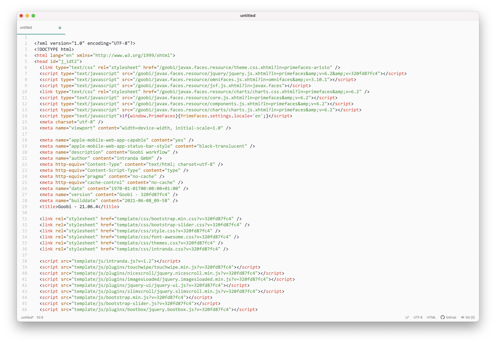
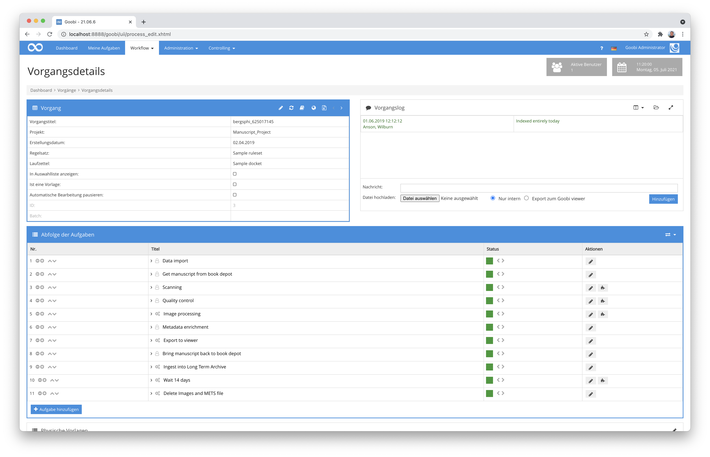
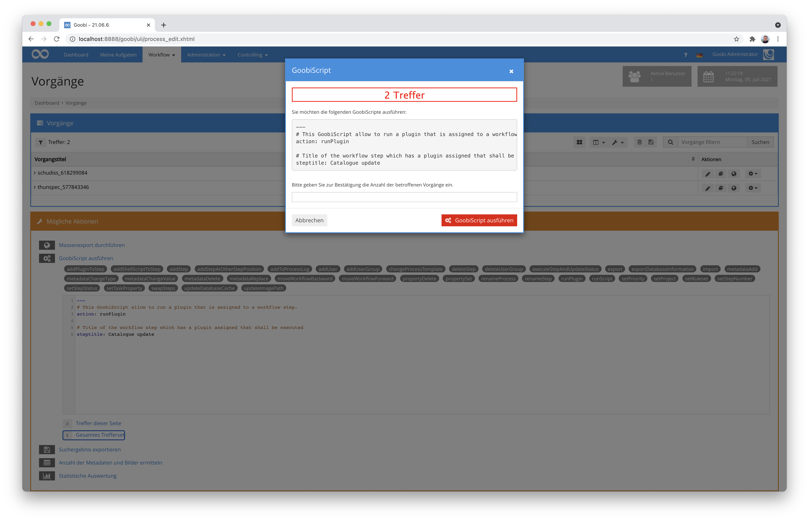
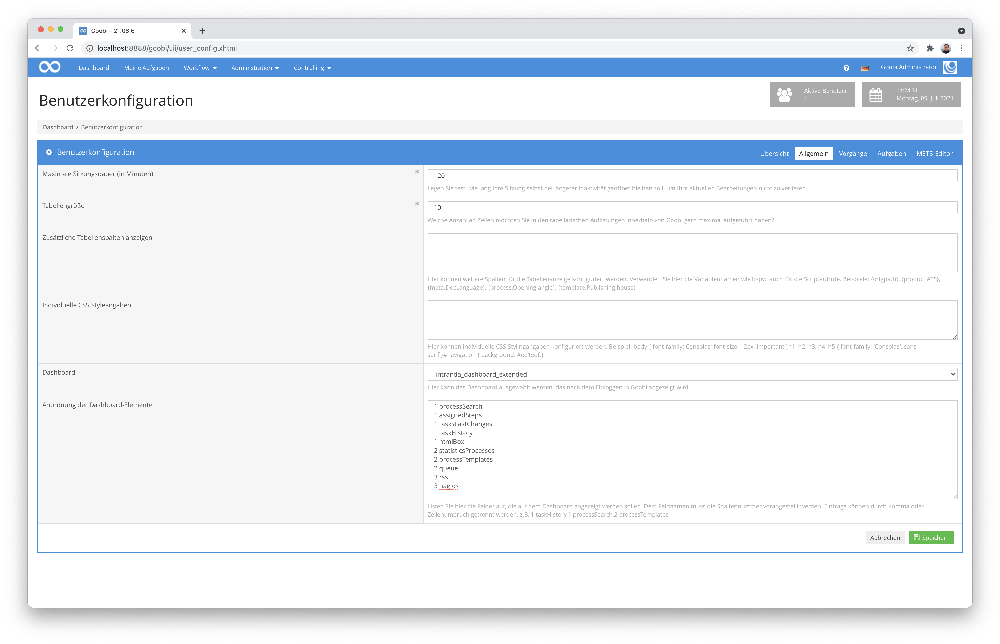

# Mai 2021

## Coming soon

- Erweiterung des Archiv-Management-Plugins
- Erweiterter Java 11 Support
- Anpassungen der Exportmöglichkeiten
- Erweiterung des Umgangs mit musealen Daten aus LIDO

## Neue Funktionalität zur Volltextbearbeitung im Metdateneditor als ALTO-Dateien

Der Goobi workflow Metadateneditor erlaubt es schon seit einiger Zeit, sich die OCR-Ergebnisse im Textformat anzusehen. Wenn man dann allerdings einen Erkennungsfehler entdeckt hat, blieben einem nur drei Möglichkeiten:

1. Das Transkriptionsplugin in Goobi workflow nutzen und `Text` anstelle von `ALTO-XML` zu exportieren, was allerdings die Markierung von Suchtreffern auf einem Bild im Goobi viewer verhindert.
2. Die ALTO-Datei mit einem separaten Texteditor im Dateisystem editieren. Das ist sehr aufwändig und für Laien kaum machbar.
3. Den Erkennungsfehler nicht korrigieren und versuchen trotzdem ruhig zu schlafen.

Seit dieser Goobi workflow Version gibt es eine neue Möglichkeit:


Man kann den neuen integrierten ALTO-Editor innerhalb des  Metadateneditors nutzen. Die Koordinaten der Wörter bleiben so erhalten und der Volltext lässt sich fast wie regulärer Fließtext bearbeiten.


Eine Hervorhebung der Zeilen und Wörter erlaubt, dass einfach ersichtlich wird, an welcher Stelle der Seite das jeweilige Wort gedruckt ist.


Die Dokumentation für die neue Funktionalität ist auch bereits im online zugänglichen Goobi workflow Handbuch zu finden:



https://github.com/intranda/goobi-workflow/commit/50302f4464c417f090593a91151eb3c127643223<br/>https://github.com/intranda/goobi-workflow/commit/4ebd2aa551680117bd8ef6f224f030a31caaef3c<br/>https://github.com/intranda/goobi-workflow/commit/04b4cddefcebb8d8675c116946bff3c1df4a9fda<br/>https://github.com/intranda/goobi-workflow/commit/293e19fc4cdc3289d4f6049868578bc7d4e21d61<br/>https://github.com/intranda/goobi-workflow/commit/c0dcfcb477ef0c3266db1d18c7ff5da495f1835b<br/>https://github.com/intranda/goobi-workflow/commit/ef8609c9de7aeee3e00d66ff62a7545d1f88c00e<br/>https://github.com/intranda/goobi-workflow/commit/c619c43bdbd02763391e253056e44b3fc4953c2f<br/>https://github.com/intranda/goobi-workflow/commit/0a4350efff933aed8a6196074f40329591b19efa<br/>https://github.com/intranda/goobi-workflow/commit/94db988c85e3861fcad3c946917e353a697a1824<br/>https://github.com/intranda/goobi-workflow/commit/e82ee6d1a2d8544a692141affda6fbffce51e31b

## Layout-Anpassungen im Metadateneditor und schnellere Ladezeiten

Wenn im Metadateneditor eine Aktion ausgelöst wird, wird selten die gesamte Seite neu geladen, damit der Arbeitsfluss nicht unterbrochen und die Scrollposition der einzelnen Container beibehalten werden kann. Bei dieser Art des Aktualisierens der Seite kann der Entwickler entscheiden, welche Teile der Seite genau aktualisiert werden sollen.

In der Vergangenheit wurden bei einigen Aktionen auch Teile der Seite aktualisiert, bei denen es nicht nötig war. Deshalb haben einige Aktionen, wie zum Beispiel das Setzen des Repräsentanten ungewöhnlich lange gedauert. Wir haben den Metadateneditor komplett auf dieses Problem hin überprüft und die Aktualisierung bei allen Aktionen optimiert.

https://github.com/intranda/goobi-workflow/commit/c8c4bb7bf26e3127795e5efef016f6c7bd88a36b<br/>https://github.com/intranda/goobi-workflow/commit/8d8fc0ba9de8344d1f8d7fe7ed1a4f6f99e2dba2<br/>https://github.com/intranda/goobi-workflow/commit/e583242c440624e4b6ee8c63691c8ed7bfd7e993<br/>https://github.com/intranda/goobi-workflow/commit/f472088c86c579faffabd33800cda5960d9227c2<br/>https://github.com/intranda/goobi-workflow/commit/5c43b1e89e32ccf9927c2770354d78950213a26b<br/>https://github.com/intranda/goobi-workflow/commit/c390ceb75df8c4219711c9ef1fa9d0d754dd5844<br/>https://github.com/intranda/goobi-workflow/commit/5550ce2393456cc214f1f21787fa49c91f841616<br/>https://github.com/intranda/goobi-workflow/commit/27a0653758593f24d7e82ef645f239ed0805f8d2<br/>https://github.com/intranda/goobi-workflow/commit/5cf7bd6e7b3176ae4692df5a25373f8474db49f6<br/>https://github.com/intranda/goobi-workflow/commit/827aa52ff63663fa1aab7028b32786e4e5206976<br/>https://github.com/intranda/goobi-workflow/commit/7cc545c634bd355d0d5b7ea66e39d5261930376c<br/>https://github.com/intranda/goobi-workflow/commit/020f270d011bb10d81ef23dddec9d095c9c2be57<br/>https://github.com/intranda/goobi-workflow/commit/5ccfbf44e4c57302b834b8a04d7d0638ec229f05<br/>https://github.com/intranda/goobi-workflow/commit/adf93e08dff00cf879fb4c4436cf935e156c6cf2<br/>https://github.com/intranda/goobi-workflow/commit/fc516f07f9170849331be0271ae093b5e38f9cdb

## Vermeidung ungewünschten Cachings für Layouts

In der Vergangenheit war es oft der Fall, dass nach einem Update beim ersten Betreten des gerade frisch aktualisierten Goobi das Layout und/oder einige Stylings völlig kaputt waren. Das lag nicht daran, dass die Entwickler schlecht gearbeitet haben, sondern daran, dass Browser wie Chrome oder Firefox Dateien auf dem lokalen Gerät zwischenspeichern, um Ressourcen und Bandbreite zu sparen. Die Dateien werden nur dann neu vom Server heruntergeladen, wenn sie sich geändert haben. Deshalb ist es nach einem Update manchmal vorgekommen, dass sich alte Dateien mit neuen Dateien gemischt haben und deshalb das Layout zerschossen war. In diesem Fall musste die Seite komplett neu geladen werden (mit der Tastenkombination `Strg`+`Shift`+`R`), um die zwischengespeicherten Dateien zu verwerfen und neu zu laden.

Damit dies in der Zukunft nicht mehr geschieht, hängen wir nun bei jedem Goobi Release einen eindeutigen, zur Version gehörenden Text an die Adresse jeder Datei an, die potentiell lokal zwischengespeichert sein könnte. Dadurch fragt der Browser bei neuen Versionen auf jeden Fall stets eine neue Datei an und das Layout sieht nach dem Update sofort korrekt aus, ohne dass geheime Tastenkombinationen gedrückt werden müssen.



https://github.com/intranda/goobi-workflow/commit/b597c0439d3f5d6004e82811929c6156100ce167

## Besserer Umgang mit Vorgängen ohne Metadaten

Goobi workflow wird sehr vielseitig eingesetzt. So gibt es auch einige Einrichtungen, die nicht an Metadaten im METS/MODS oder LIDO Format interessiert sind. Bei diesen Einrichtungen ist es aufgefallen, dass Skriptaufrufe zwingend eine `meta.xml` Datei im Vorgangsordner verlangen, da sie sonst mit einem Fehler abgebrochen werden. Dies wurde nun geändert, so dass die Datei `meta.xml` bei Scriptaufrufen nur noch dann gelesen wird, wenn auch tatsächlich Metadateninformationen innerhalb des Scriptaufrufs benötigt werden.



https://github.com/intranda/goobi-workflow/commit/d7d7d2ca5fa60a59c2ef3a996eaa43c5acb2845a

## Anpassungen an der Funktionalität von GoobiScript

Nachdem im letzten Monat die GoobiScript-Runtime komplett neu implementiert wurde, sind noch einige Probleme mit GoobiScripts aus Plugins aufgetaucht, die dazu geführt haben, dass die Plugins nicht richtig funktioniert haben. Diese Probleme wurden nun behoben und alles funktioniert wieder so wie gewohnt.



https://github.com/intranda/goobi-workflow/commit/d154874ba63a7e815267db378218c551cf11273c<br/>https://github.com/intranda/goobi-workflow/commit/a8320d942345e6aaa39bc856a1d701184c2ed0ae<br/>https://github.com/intranda/goobi-workflow/commit/d232a0f60d6db4b81c3c14d0ade4ddc1e668c97c

## Neue Funktionen und Einstellmöglichkeiten des Dashboards

Das erweiterte Dashboard wurde noch weiter erweitert. Es gibt zwei neue Widgets: Das Widget `Änderungen der letzten 7 Tage` zeigt Schritte an, die in den letzten 7 Tagen abgeschlossen, in Bearbeitung genommen wurden oder Fehler hatten. Das zweite neue Widget zeigt die Schritte an, die sich derzeit in der Warteschlange befinden. Dabei wird der im letzten Monat eingeführte neue `INFLIGHT` Status zugrunde gelegt.


Neu ist außerdem dass das Layout des Dashboards nun individuell über die Nutzereinstellungen konfiguriert werden kann. Diese Konfiguration kann vorgenommen werden, indem innerhalb der nutzerspezifischen `Benutzerkonfiguration` im Reiter `Allgemein` die Einstellung `Anordnung der Dashboard-Elemente` bearbeitet. Jede Zeile innerhalb der Textbox fügt ein Element zum Dashboard hinzu. Dabei besteht jede Zeile aus zwei Teilen, getrennt durch ein Leerzeichen: Zuerst wird eine Zahl angegeben, die die Spalte festlegt, in der das Widget angezeigt werden soll. Der zweite Teil nach dem Leerzeichen ist dann der Name des hinzuzufügenden Widgets.  

Die Liste der aktuell verfügbaren Widgets lautet:
`assignedSteps`, `batches`, `htmlBox`, `itm`, `nagios`, `processSearch`, `processTemplates`, `queue`, `rss`, `statisticsProcesses2`, `statisticsProcesses`, `taskHistory`, `tasksLastChanges`.

Eine Beispielkonfiguration könnte dabei folgendermaßen aussehen:

```
1 processSearch
1 assignedSteps
1 tasksLastChanges
1 taskHistory
1 htmlBox
2 statisticsProcesses
2 processTemplates
2 queue
3 rss
3 nagios
```


