# Juli 2021

## Coming soon

- Performance Optimierungen für sehr große Datenbestände
- Entwicklung eines neuen Erfassungsplugins für die Integration mit Atlas AEON
- Entwicklung eines Plugins für die gleichzeitige Bearbeitung von Metadaten aus mehreren Vorgängen
- Entwicklung eines neuen Konfigurationseditors

## Erweiterung des Archiv-Management-Plugins

Die Entwicklung eines Plugins für die Kombination der Bearbeitung von Archivbeständen mit der Möglichkeit, diese selektiv zu digitalisieren, erweckt immer mehr Interesse und ist schon in mehreren Einrichtungen im Produktiveinsatz. In dem Kontext fallen dann naturgemäß noch einmal Bereiche auf, die noch nachjustiert werden sollten, um weitere Einsatzzwecke mit abdecken zu können:

### Anpassungen für das Anlegen von Vorgängen in Masse

Bisher konnte man innerhalb des Archiv-Management-Plugins einzelne Verzeichniseinheiten auswählen, um für diese einen Vorgang erzeugen zu lassen, der dann seinen Workflow durchläuft. Neu ist nun, dass dies auch für einen ganzen Bereich von Verzeichniseinheiten möglich ist.


Dazu wählt man einfach einen übergeordneten Knoten aus dem Bestand aus und wählt die zu verwendende Produktionsvorlage. Anschließend wird für jede Verzeichniseinheit, für die bisher noch kein Vorgang existiert, ein neuer Vorgang erzeugt und erlaubt dessen Verarbeitung.

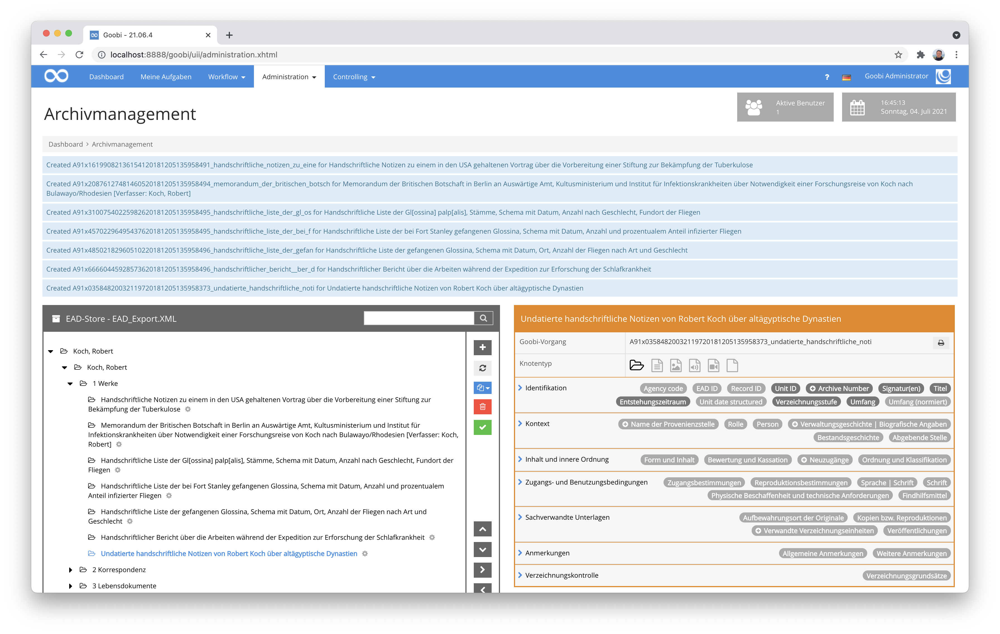

### Überarbeitung der Bedienlogik bei leerem Datenbestand

Neben der neuen geschilderten Funktionalität für das Erzeugen von Vorgängen, gab es auch einige kleinere Änderungen in der Bedienlogik. Insbesondere wenn es darum ging, dass noch kein Archivbestand vorliegt und daher ein ganz neuer Bestand angelegt werden sollte, gab es Verbesserungsbedarf, den wir in Angriff genommen haben.

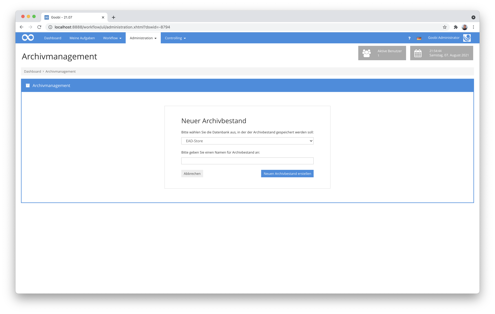

Das Hinzufügen neuer Bestände ist entsprechend nun einfacher und im Fall auftretender Probleme auch besser nachvollziehbar.

## Arbeit mit mehreren Tabs jetzt möglich

Ein Feature dass wir uns alle schon lange gewünscht haben, ist endlich umgesetzt worden: Die Arbeit in Goobi innerhalb mehrerer Tabs bzw. Browserfenster.

In der Vergangenheit war es immer wieder mal ein beobachtetes Problem, dass Anwender von Goobi workflow versucht haben, Informationen z.B. aus einem Projekt auch bei einem anderen Projekt einzutragen und sie daher mit mehreren Fenstern gleichzeitig arbeiten wollten. Dies war allerdings bisher nicht ganz unproblematisch, da Goobi im Hintergrund jeweils nur ein solches Element gleichzeitig laden konnte. Aus diesem Grund war im Hintergrund stets das zuletzt betretene Objekt dasjenige, das geladen war und das auch entsprechend gespeichert wurde. Dies führte in der Vergangenheit des Öfteren zu großen Irritationen. Nun jedoch ist diese Einschränkung beseitigt, so dass eine Arbeit mit dem gleichen Browser in der gleichen Session und mit mehreren Tabs möglich geworden ist.

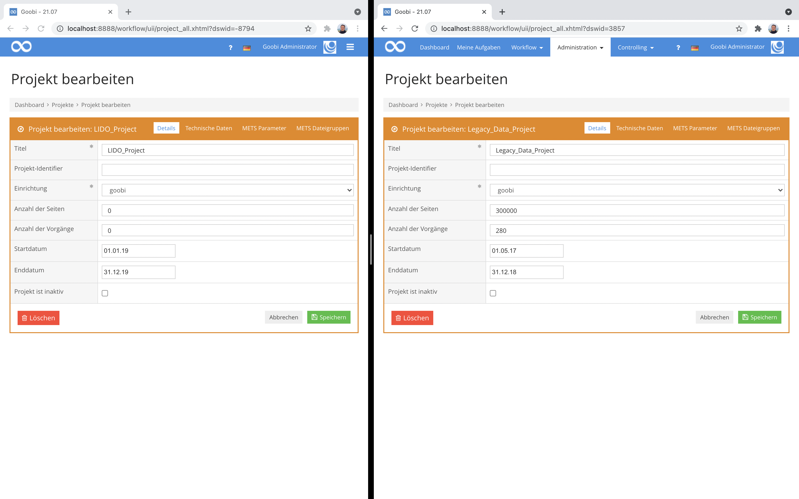

Eine Einschränkung gilt hier derzeit noch: Es können momentan maximal 64 Tabs gleichzeitig mit Goobi verwendet werden. Wenn dies eines Tages aber doch einmal zu wenig sein sollte, können wir den Wert aber auch auf maximal 1024 Tabs hochsetzen. :)

## Ankündigung: Java 11 wird ab dem 01.09.2021 zur zwingenden Voraussetzung

Bereits seit einiger Zeit verwenden wir Java 11 schon für die Entwicklung von Goobi workflow. Auch bei Neuinstallationen und Updates werden die installierten Systeme mittlerweile auf Java 11 umgestellt.


Ab dem 1. September 2021 werden wir Java 11 nun für alle Syteme zu einer verpflichtenden Voraussetzung machen. Sollte ein System entsprechend bisher noch nicht auf Java 11 aktualisiert worden sein, so muss dies nach diesem Termin spätestens mit dem nächsten Goobi workflow Update zwangsläufig erfolgen.

## Export von Vorgängen nur wenn gewünscht

Bisher konnten Vorgänge, die keinen expliziten Exportschritt im Workflow enthalten, über die administrativen Ansichten (z.B. mittels GoobiScript) dennoch exportiert werden. Da dieses Verhalten für Materialien mit Schutzrechten allerdings nicht immer gewünscht war, haben wir hier eine Änderung vorgenommen. und das Verhalten angepasst. Exporte sind somit nur noch für Vorgänge möglich, wenn diese auch einen Arbeitsschritt enthalten, der als `Export` gekennzeichnet ist.

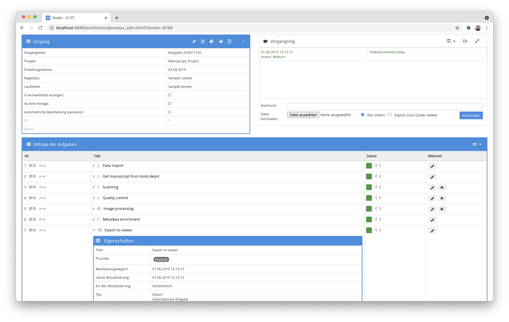

Diese Änderung wurde für folgende Bereiche berücksichtigt:

* GoobiScript für die Durchführung von Massenexporten
* Button in der Vorgangsauflistung
* Button innerhalb der Vorgangsdetails
* Das Command-Plugin für den Export

## Download der Logdatei für Vorgänge

Innerhalb der Vorgangsliste von Goobi workflow stehen bereits seit langem verschiedene erweiterte Funktionen zur Verfügung. So kann man dort unter anderem die Laufzettel nachträglich generieren lassen und herunter laden. Auch die interne Logdatei des gewählten Vorgangs ließ sich an dieser Stelle generieren. Allerdings wurde sie bisher ausschließlich in den Benutzerordner des Anwenders innerhalb des Server-Dateisystems gespeichert, so dass ein Zugriff darauf bisher recht umständlich war. Dies wurde angepasst. Die Logdatei ist nun genauso herunterladbar wie beispielsweise der Laufzettel und eine Gesamt-PDF-Datei des jeweiligen Vorganges auch.

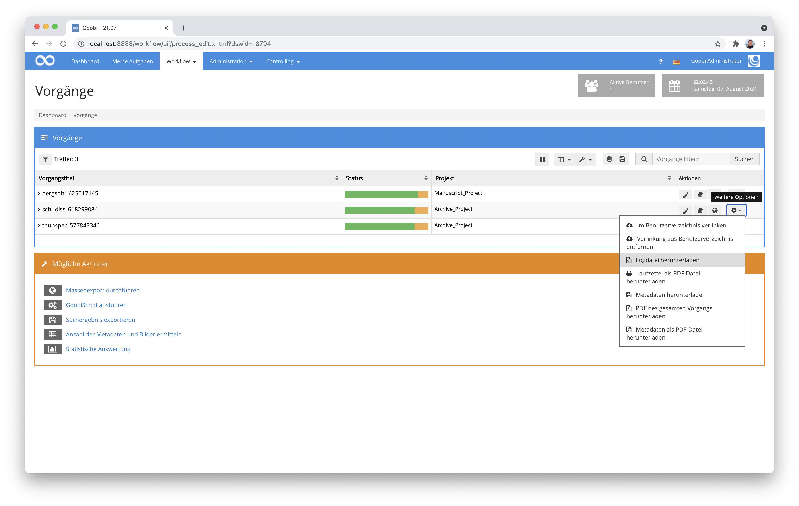

## Neues Plugin für das Übernehmen von Bildern aus dem Dateisystem

Wir haben ein neues Plugin entwickelt, das die Übernahme von Bildern vereinfachen soll. Dies wird insbesondere bei Massenimporten interessant. Der Bedarf entstand bei uns, um nach der automatischen Erzeugung von Vorgängen aus einem vorgandenen Archivbestand einer EAD-Datei im Archiv-Management-Plugin die Bilder übernommen werden sollten, die innerhalb der EAD-Datei in einem Metadatum allerdings in unvollständiger Form aufgeführt wurden. Mit diesem Plugin ist es daher möglich, dass solche Informationen ausgewertet, anhand von Trennzeichen aufgesplittet und dann mit zusätzlichen Pfadangaben versehen werden, um so anschließend die Dateien tatsächlich zu übernehmen.

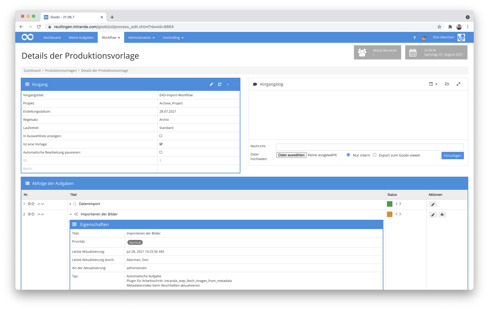

Eine Dokumentation für dieses Plugin wurde noch nicht veröffentlicht und folgt in den nächsten Tagen. Das gleiche gilt ebenso für die Veröffentlichung des Plugins bei Github.

## Benutzergruppen und Projekte hinzufügen

Wenn die Details eines Benutzers bearbeitet werden, so konnte man bisher stets auch festlegen, zu welchem Projekt und zu zu welcher Benutzergruppe der Benutzer gehören soll. An dieser Stelle wurde bisher der Button zum Hinzufügen von Benutzergruppen und Projekte auch dann angezeigt, wenn der Nutzer bereits zu allen vorhanden Gruppen und Projekten gehörte.

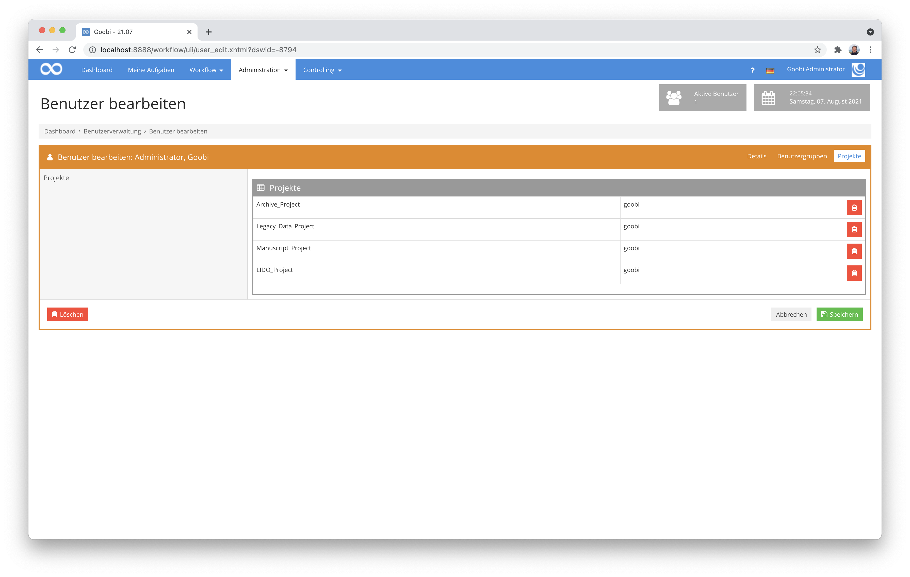

Die Nutzeroberfläche wurde nun daraufhin angepasst, dass die Buttons zum Hinzufügen nur noch dann angezeigt werden, wenn sie auch eine Funktion erfüllen können, es also noch Benutzergruppen und Projekte gibt, bei denen der Benutzer noch kein Mitglied ist. Damit ist die Administration von Benutzern noch einmal etwas einfacher geworden.

## Erweiterte Suche nach Batches

Die erweiterte Suche nach Batches ermöglicht es, alle Vorgänge eines bestimmten Batches zu finden. Die Suchsyntax für eine solche Suche sieht z.B. so aus:

```
"batch:42"
```

Mit dieser Suche werden alle Vorgänge gefunden, die sich im Batch mit der ID `42` befinden. Das Gegenteil dieser Suche, also all derjenigen Vorgänge, die *nicht* im Batch `42` sind, war bisher nicht möglich. Diese neue Suchmöglichkeit wurde nun implementiert und sieht entsprechend folgendermaßen aus:

```
"-batch:42"
```

Die Erweiterung dieser Suchmöglichkeit ist innerhalb des Goobi Handbuches auch bereits dokumentiert:



## OAI-PMH Harvester für EAD-Dateien

Für ein Projekt war es notwendig, EAD-Dateien aus einer OAI-Schnittstelle zu harvesten. Dazu haben wir ein neues Plugin entwickelt, was für alle Daten der konfigurierten Schnittstelle Vorgänge in Goobi workflow anlegt, sofern diese noch nicht existieren.

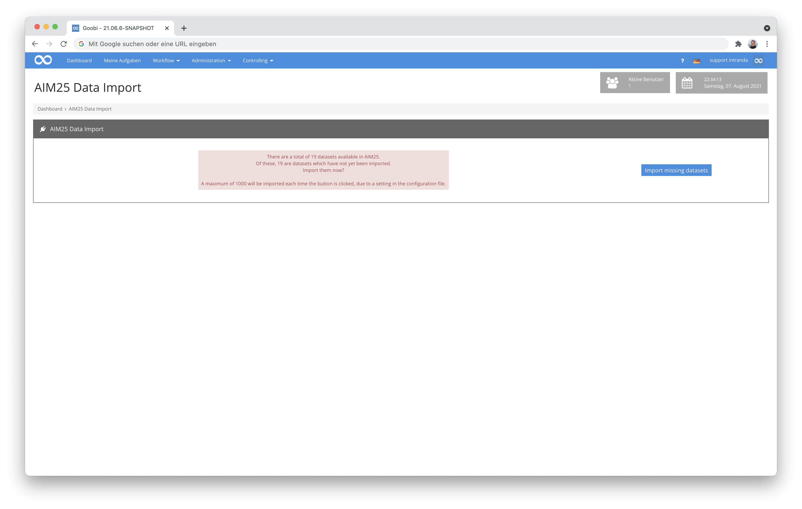

Während der Ausführung des Plugins werden gemäß einer Konfiguration von XPath-Ausdrücken die Metadaten selektiv nach METS überführt. 

Eine Dokumentation für dieses Plugin wurde noch nicht veröffentlicht und folgt in den nächsten Tagen. Das gleiche gilt ebenso für die Veröffentlichung des Plugins bei Github.

## Institution wird nicht mehr immer angezeigt

Seit noch nicht allzu langer Zeit verfügt Goobi workflow über die Möglichkeit, dass mehrere Institutionen mit jeweils eigenen Administratoren in einer Instanz arbeiten können. Da eine solche Arbeitsweise jedoch sehr selten im Alltag vorkommt, haben wir die Anzeige von Institutionen nun etwas dynamischer gestaltet.

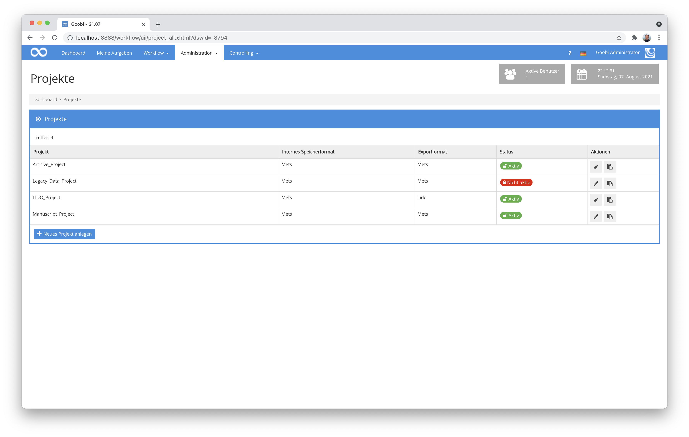

Von nun an werden Institutionen innerhalb der Auflistungen von Benutzern, Gruppen und Projekten nur noch angezeigt, wenn mehr als eine Institution konfiguriert wurde. Dies macht die Arbeit mit Goobi an dieser Stelle wieder etwas übersichtlicher.

## Nutzer-Verwaltung jetzt mit besserer Suche und Sortierbarkeit

In der Nutzer-Verwaltung ließ sich bisher nur nach dem Namen der Nutzer suchen. Mit den neuesten Änderungen ist es nun möglich, auch alle weiteren Felder zu durchsuchen. Außerdem ist eine Sortierung jetzt auch über alle Spalten der Nutzertabelle möglich.

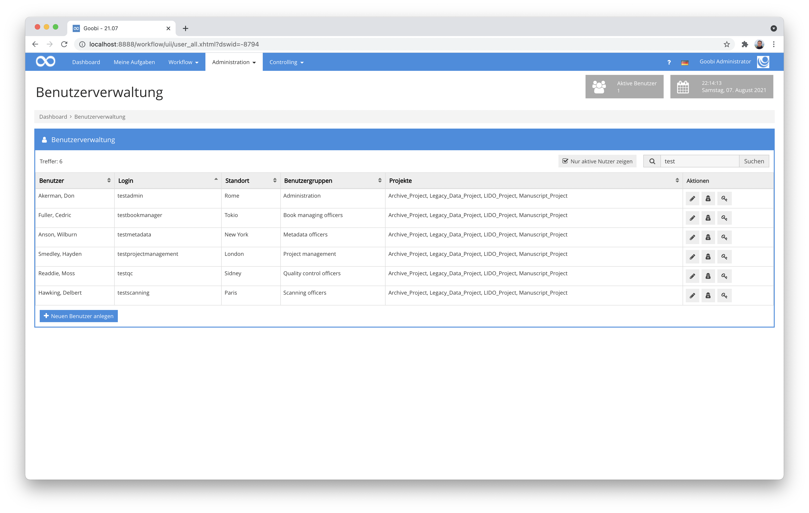

## Anzeige der aktiven Nutzer

In der Vergangenheit gab es öfter Verwirrung bei Goobi-Nutzern, die sich über unbekannte IPs in der Auflistung der eingeloggten Nutzer bzw. der Anzeige unbekannter aktiver Sessions wunderten. Hier wurden in der Vergangenheit auch fälschlicherweise Sicherheitsprobleme befürchtet. Um diese Verwirrungen künftig zu vermeiden wird die Liste der Sessions jetzt für die Anzeige der aktiven Nutzer gefiltert und nur noch diejenigen angezeigt, die auch tatsächlich eingeloggt sind. So vermeiden wir potentielle Missverständnisse und Fehlinterpretationen, die sich aus der Anzeige ergeben könnten.

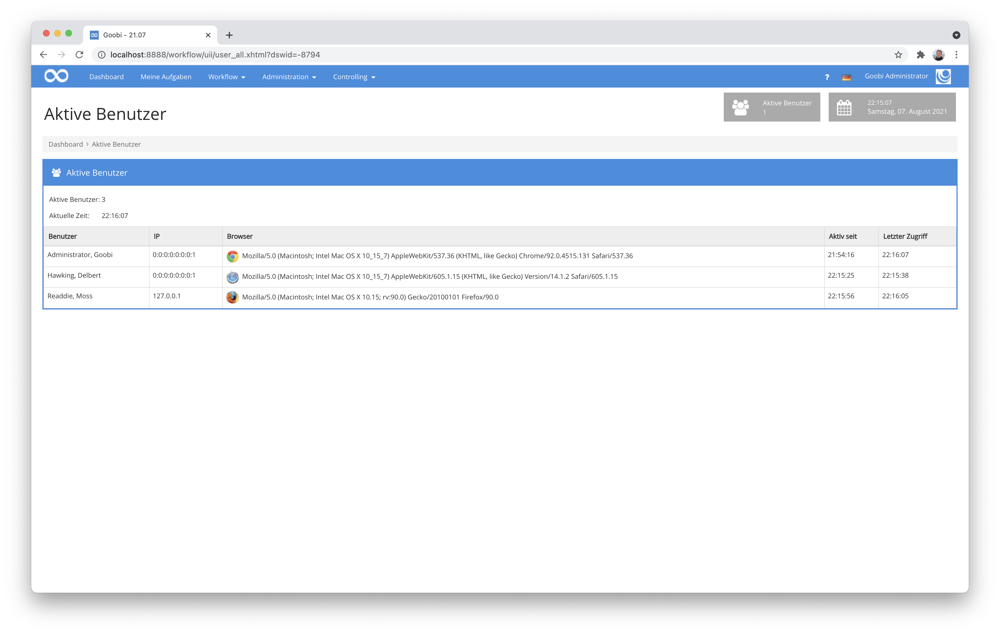

## Anpassungen am Metadateneditor

Im Bereich des Metadateneditors gab es wieder viele Änderungen, auf die wir hier kurz eingehen möchten:

### Integration der Normdatenbank KulturNav

Dank der Unterstützung von [@hemed](https://github.com/hemed) aus der Universitätsbibliothek Bergen ist Goobi nun in der Lage, die insbesondere in Skandinavien sehr populäre Normdatenbank KulturNav zu durchsuchen und Normdaten aus dieser zu übernehmen. Diese Entwicklung war tatsächlich bisher der erste größere Pull-Request, den wir auf GitHub von einem externen Entwickler entgegen genommen haben.


Hier finden sich die technischen Details zu den Entwicklungen zusammen mit der umfangreichen Kommunkation zwischen den beteiligten Entwicklern:



Dank Dir [@hemed](https://github.com/hemed) für diese großartige Zusammenarbeit und Euren Beitrag zu Goobi workflow!

### Kleine visuelle Anpassung im Menü

Im oberen Menü des Metadateneditors gab es eine kleine Inkonsistenz, wenn man die Maus über die Einzelbild/Thumbnail Buttons bewegt hat. Die Anzeige wurde angepasst und sollte sich damit jetzt erwartungskonform verhalten.

### Fokus in der Seitenauswahl

Bei der Thumbnailanzeige während der Paginierung kam es zu unerwünschten Scrolleffekten, wenn man ein Bild angeklickt hat. Dieser Fehler wurde behoben.

### Zurücksetzen der Paginierung im Metadateneditor jetzt mit Warnung

Im Metadateneditor gibt es einige Aktionen, bei denen die METS-Datei unmittelbar gespeichert wird. Beispiele dafür sind unter anderem die beiden Buttons, die die Paginierung zurücksetzen bzw. anhand der tatsächlich vorhandenen Bilddateien neu erzeugen. Dieses Verhalten trifft Anwender oft unerwartet und deshalb wird jetzt vor der Durchführung dieser Aktionen eine Warnung angezeigt, dass die Änderungen direkt gespeichert werden und nur durch einen Administrator rückgängig gemacht werden können.

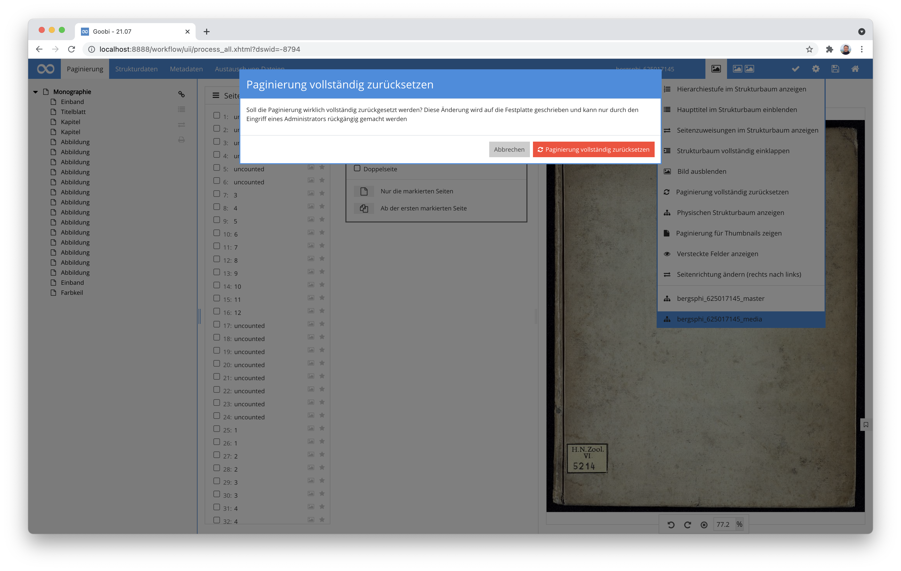

## Anlegen von Vorgängen

Auch in dem Bereich, der für das Neuanlegen von Vorgängen verantwortlich ist, haben wir einige Änderungen vorgenommen:

### Verbesserte Fehlerbehandlung beim Erzeugen von Vorgängen

Im Falle, dass es beim Neuanlegen von Vorgängen zu unerwarteten Fehlern kommt, wird nun detaillierter auf die aufgetretenen Fehler hingewiesen. Fehlerhaft erzeugte Vorgänge sollten durch diese Anpassungen noch seltener auftreten.

Eine ähnliche Anpassung haben wir auch für den Fall vorgenommen, dass z.B. aufgrund von besonderen Regelsatzkonfigurationen keine Metadatendatei `meta.xml` angelegt werden konnte. Auch hier erfolgt nun eine hilfreiche Anzeige einer Fehlermeldung und unterbindet das fehlerhafte Anlegen eines Vorgangs ohne Metadatendatei.

## Anlegen von Vorgängen in deaktivierten Projekten

Wenn Projekte auf inaktiv gesetzt werden, werden von nun an die Buttons zum Neuanlegen von Vorgängen bei den Produktionsvorlagen in rot dargestellt und mit einer Warnung versehen, dass das zugehörige Projekt deaktiviert ist. Darüber hinaus wird auch der Projektname grau eingefärbt, um auf dessen Deaktivierung hinzuweisen.

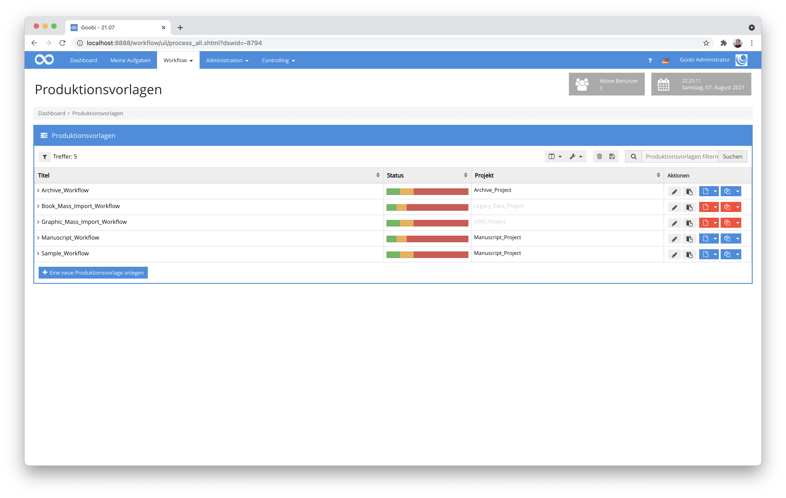

### Bearbeiter für das Neuanlegen von Vorgängen ist nicht mehr bei allen Schritten eingetragen

Beim Neuanlegen von Vorgängen wurde derjenige Benutzer, der die Vorgänge erzeugt auch bei sämtlichen Arbeitsschritten des Workflows als der letzte Bearbeiter eingetragen, noch bevor die Arbeitsschritte tatsächlich bearbeitet wurden. Dies hat in der Vergangenheit zwar nicht gestört und auch sonst keinen unerwünschten Seiteneffekt aufgewiesen. Irritierend fanden wir es dennoch und haben es jetzt einmal verbessert.

## Anpassungen am erweiterten Dashboard

Das erweiterte Dashboard ist superbeliebt und fast in jeder Goobi-Installation im Einsatz. Hier haben wir in diesem Monat einige Anpassungen vorgenommen:

### Vorgänge pro Monat nur für berechtigte Projekte

Auf dem Dashboard wird üblicherweise ein Diagramm angezeigt, dass die Anzahl der hinzugefügten Vorgänge der letzten Monate visualisiert. Dabei wurden bisher alle Vorgänge aufgeführt, die in der Goobi-Instanz vorliegen. Mit einer Änderung an dieser Stelle verhält sich das Diagramm nun etwas hilfreicher: Es werden von nun an nur noch diejenigen Vorgänge in dem Diagramm berücksichtigt, die in Projekten sind, bei denen der Nutzer auch Mitglied ist. Dies ist für den Anwender deutlich intuitiver.

### Widgets ohne Inhalt werden ausgeblendet

So hilfreich das Dashboard auch ist und so viel es auch anzeigen kann; manchmal sind einige der Widgets nicht mit Daten gefüllt, weil sie schlichtweg nicht vorliegen. Dass dann allerdings leere Widgets angezeigt wurden, fanden wir unschön. Aus diesem Grund ist die Anzeige jetzt überarbeitet und blendet leere Widgets jetzt aus.


## Weitere Anpassungen

Es gab wieder zahlreiche kleinere Anpassungen in verschiedenen Bereichen, die nicht unerwähnt bleiben sollen.

### Vorgangstitel im Firefox wieder markierbar

Durch die Umstellung auf Buttons aus Accessibility-Gründen waren im Firefox die Vorgangstitel in der Vorgangslisten nicht mehr markierbar. Dies war umständlich, wenn man einen solchen Titel doch einmal in die Zwischenablage kopieren wollte. Aus diesem Grund haben wir hier eine Änderung vorgenommen, damit dies wieder möglich ist.

### Anpassungen bei Umbenennung von Vorgängen

Wenn in Goobi ein Vorgang umbenannt wird, werden im Hintergrund auch alle Verzeichnisse im Vorgangsverzeichnis umbenannt, damit diese zum neuen Vorgangsnamen passen. Bisher wurden symbolische Links hierbei ausgelassen. Das wurde geändert und symbolische Links werden von nun an ebenfalls mit umbenannt.


### Vorgangslog: Bei allen Icons einheitliche Titel

Innerhalb der Vorgangsdetails wurden nicht für alle Buttons konsistente Mouse-over-Texte angezeigt. Dies haben wir vereinheitlicht.

## Versionsbezeichnung

Die aktuelle Versionsnummer von Goobi workflow lautet mit diesem Release: **21.07**.
Innerhalb von Plugin-Entwicklungen muss für Maven-Projekte innerhalb der Datei `pom.xml` entsprechend folgende Abhängigkeit eingetragen werden:

```xml
<dependency>
  <groupId>de.intranda.goobi.workflow</groupId>
  <artifactId>goobi-core-jar</artifactId>
  <version>21.07</version>
</dependency>
```
